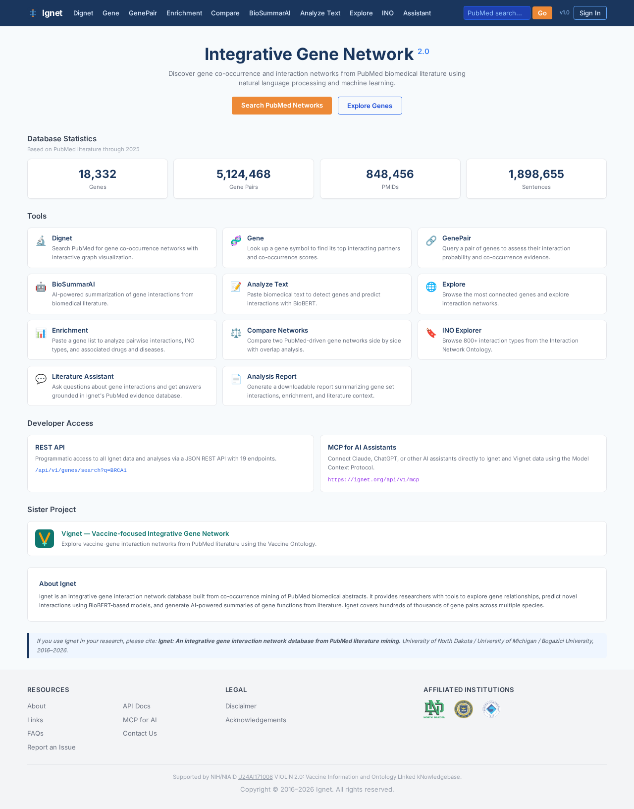

# Ignet — Integrative Gene Network Database



## Overview

Ignet is an open-access database that empowers researchers to discover gene-gene interactions and co-occurrence networks from biomedical literature at scale. By automatically extracting gene relationships from millions of PubMed abstracts using BioBERT and natural language processing, Ignet enables rapid, literature-based hypothesis generation in minutes rather than weeks of manual literature review.

Whether you're investigating vaccine mechanisms, understanding cancer biology, identifying drug targets, or exploring disease pathways, Ignet provides interactive tools to explore **5.1 million gene pairs** and **1.9 million evidence sentences** extracted from **848,456 PubMed abstracts**.

**Live Site**: https://ignet.org/ignet/

## Features

- **Dignet** — Build interactive gene co-occurrence networks from PubMed keyword searches with Cytoscape visualization
- **Gene Search & Profile** — Look up individual genes and explore their top interaction partners, associated drugs, and diseases
- **GenePair Analysis** — Query specific gene pairs and examine evidence sentences with BioBERT prediction scores
- **BioSummarAI** — Automatically generate AI-powered literature summaries of gene interactions from your custom gene lists
- **Analyze Text** — Paste biomedical text and extract genes with BioBERT; predict interactions in custom content
- **Explore** — Browse and search the most connected genes in the database without specifying a topic
- **Gene Set Enrichment** — Analyze how a list of genes interact together, with enriched drug and disease associations
- **Compare Networks** — Side-by-side analysis of two PubMed queries showing unique and shared genes
- **INO Explorer** — Browse the Interaction Network Ontology (800+ standardized interaction types)
- **Literature Assistant** — Ask natural-language questions about gene interactions with evidence-grounded answers
- **Gene Set Builder** — Create and save persistent gene collections for reuse across tools
- **Generate Reports** — Create downloadable HTML analysis reports with network visualizations and statistics
- **REST API & MCP** — Programmatic access with 30+ endpoints and 8-tool MCP interface for AI assistants

## Database Statistics

**PubMed Literature Analysis** (pubmed26n, through 2025):

- **18,332 genes** indexed from biomedical literature
- **5,124,468 gene-gene co-occurrence pairs** with BioBERT prediction scores
- **1,898,655 sentences** containing gene mentions and interactions
- **42,578,113 INO annotations** linking genes to standardized interaction types
- **7,071,575 DrugBank annotations** connecting genes to drugs
- **18,817,630 disease associations** from Human Disease Ontology
- **586,455 vaccine-related annotations** from Vaccine Ontology

## Data Sources

Ignet integrates multiple authoritative biomedical data sources:

- **PubMed Literature** — 848,456 biomedical abstracts analyzed for gene co-occurrence
- **BioBERT** — Machine learning model predicting gene interactions from text
- **Interaction Network Ontology (INO)** — 800+ standardized terms for molecular interactions
- **DrugBank** — 7,000+ drugs linked to gene targets
- **Human Disease Ontology (HDO)** — Disease classifications and gene-disease relationships
- **Vaccine Ontology (VO)** — Vaccine-specific genes and interactions

## Tech Stack

### Frontend

- **React 19** — Modern UI framework with hooks and functional components
- **Vite 8** — Lightning-fast build tool and dev server
- **Tailwind CSS 3** — Utility-first CSS framework for responsive design
- **Cytoscape.js** — Interactive network visualization library
- **Shadcn/ui** — Accessible component library built on Radix UI and Tailwind
- **React Router** — Client-side routing for multi-page SPA

### Backend

- **Flask** — Lightweight Python web framework for REST API
- **Waitress** — Production WSGI server
- **Python 3.12** — Modern Python runtime
- **MariaDB** — Relational database for gene pairs, sentences, and annotations

### AI Services

- **BioBERT (Port 9635)** — Gene extraction and interaction prediction service
- **BioSummarAI (Port 9636)** — AI literature summarization powered by GPT-4o
- **Claude AI** — Context-aware conversation and evidence-grounded Q&A

### Infrastructure

- **Docker** — Containerized deployment
- **Kubernetes** (optional) — Orchestration for scale
- **Vercel** — Frontend hosting and CDN
- **AWS/GCP** — Backend database and API hosting

## REST API

Ignet provides a fully-featured REST API for programmatic access to all data and analyses.

**Base URL**: `https://ignet.org/api/v1/`

**Sample Endpoints** (30+ total):

```bash
# Search for a gene
curl https://ignet.org/api/v1/genes/search?query=IFNG

# Get detailed gene information
curl https://ignet.org/api/v1/genes/IFNG

# Query a gene pair
curl https://ignet.org/api/v1/pairs/search?gene1=IFNG&gene2=TNF

# Run enrichment analysis
curl -X POST https://ignet.org/api/v1/enrichment \
  -H "Content-Type: application/json" \
  -d '{"genes": ["IFNG", "TNF", "IL6"]}'

# Search PubMed
curl https://ignet.org/api/v1/pubmed/search?query=vaccine

# Get drugs targeting a gene
curl https://ignet.org/api/v1/genes/TP53/drugs
```

**Authentication**: No API key required for public access
**Rate Limiting**: Fair use policy; contact support for high-volume access
**Response Format**: JSON

See [API Documentation](https://ignet.org/ignet/api-docs) for complete endpoint reference.

## MCP — Model Context Protocol

Ignet exposes a Model Context Protocol (MCP) endpoint for seamless integration with AI assistants.

**Endpoint**: `https://ignet.org/api/v1/mcp`

**Available Tools** (8 tools):

1. `search_genes` — Find genes by symbol or keyword
2. `get_gene_profile` — Retrieve detailed gene information with interaction partners
3. `find_gene_interactions` — Query evidence for specific gene pair interactions
4. `search_pubmed` — Find PubMed papers on a biological topic
5. `enrichment_analysis` — Analyze a gene set for enriched pathways and drugs
6. `predict_interaction` — Predict whether two genes interact
7. `get_drugs` — Find drugs targeting specific genes
8. `get_diseases` — Find diseases associated with genes

**Usage Example** (with Claude):

```
User: "What genes interact with BRCA1 and are targets of cancer drugs?"

Claude uses the MCP tools to:
1. search_genes("BRCA1") → get BRCA1 details
2. find_gene_interactions(BRCA1) → get top 20 partners
3. get_drugs(BRCA1) → find cancer drugs

Response: "BRCA1 interacts with 1,247 genes. Top partners include RAD51,
TP53, PALB2. Drugs targeting BRCA1-related pathways include olaparib
and rucaparib (PARP inhibitors)..."
```

Connect any Claude, ChatGPT, or other AI-powered application to Ignet to ground responses in evidence.

## Installation & Development

### Prerequisites

- **Node.js 20+** (frontend)
- **Python 3.12+** (backend)
- **MariaDB 10.6+** (database)
- **Docker** (optional, for containerized deployment)

### Local Development Setup

**1. Clone the repository:**

```bash
git clone https://github.com/hurlab/ignet.git
cd ignet
```

**2. Set up the frontend:**

```bash
cd frontend
npm install
npm run dev  # Runs on http://localhost:5173
```

**3. Set up the backend:**

```bash
cd api
python3 -m venv venv
source venv/bin/activate  # On Windows: venv\Scripts\activate
pip install -r requirements.txt
python app.py  # Runs on http://localhost:5000
```

**4. Configure environment variables (REQUIRED for production):**

Create `biosummarAI/.env` with the following keys. The API loads this file on startup.

```bash
# Database
DB_HOST=localhost
DB_USER=ignet
DB_PASSWORD=<your-mysql-password>
DB_DATABASE=ignet

# OpenAI (for BioSummarAI / Assistant features)
OPENAI_API_KEY=sk-...

# Auth — generate ONCE with the helper script and persist
# (these MUST be stable across restarts, otherwise all sessions invalidate
#  and BYOK keys become unreadable)
JWT_SECRET=<run: scripts/generate_secrets.sh>
FERNET_KEY=<run: scripts/generate_secrets.sh>

# Optional
IGNET_PIPELINE_TRACKER=/var/lib/ignet/last_processed_number.txt
NCBI_API_KEY=
```

Generate the auth secrets:
```bash
bash scripts/generate_secrets.sh >> biosummarAI/.env
```

**5. Configure database:**

```bash
# Create tables from schema dump
mysql -u root -p ignet < scripts/schema_ignet.sql
```

**6. Start AI services:**

```bash
# BioBERT service (port 9635)
cd services/biobert
docker build -t biobert .
docker run -p 9635:5000 biobert

# BioSummarAI service (port 9636)
cd services/biosummarai
docker run -p 9636:5000 biosummarai
```

**7. Access the application:**

- Frontend: http://localhost:5173
- API: http://localhost:5000/api/v1
- Full development environment ready

### Docker Deployment

```bash
# Build and run all services
docker-compose up -d

# Services will be available at:
# - Frontend: http://localhost
# - API: http://localhost/api/v1
# - BioBERT: http://biobert:5000
# - BioSummarAI: http://biosummarai:5000
```

### Production Deployment

**Vercel (Frontend)**:

```bash
npm install -g vercel
vercel deploy
```

**systemd (Linux bare-metal)**:

The API, BioBERT service, and BioSummarAI service are designed to run as systemd units. Example unit (adjust paths and user for your environment):

```ini
[Unit]
Description=Ignet REST API
After=network.target mariadb.service redis.service

[Service]
Type=simple
User=<your-user>
WorkingDirectory=/opt/ignet/api
ExecStart=/opt/ignet/api/venv/bin/python run.py
EnvironmentFile=/opt/ignet/biosummarAI/.env
Environment=PYTHONUNBUFFERED=1
Restart=on-failure

[Install]
WantedBy=multi-user.target
```

## Database Schema

Ignet uses MariaDB with the following key tables:

| Table | Rows | Purpose |
|-------|------|---------|
| `t_gene` | 18,332 | Gene metadata (symbol, name, entrez ID) |
| `t_gene_pairs` | 5,124,468 | Co-occurrence pairs with BioBERT scores |
| `t_sentences` | 1,898,655 | Actual sentences containing genes |
| `t_pmids` | 848,456 | PubMed metadata (title, abstract, journal) |
| `t_ino` | 42,578,113 | Interaction Network Ontology annotations |
| `t_drug` | 7,071,575 | DrugBank gene-drug associations |
| `t_hdo` | 18,817,630 | Disease Ontology associations |
| `t_vo` | 586,455 | Vaccine Ontology annotations |

**Co-occurrence Tables** (6 tables linking vaccine, drug, disease, VO genes):

- `t_vo_gene_pairs` — Vaccine genes and their interactions
- `t_vaccine_drug_enrichment` — Vaccines linked to drug targets
- Cross-entity network tables enabling vaccine-disease-drug analysis

For schema details, see `docs/schema.md`.

## Development Roadmap

**Current Version**: 2.0 (2025-2026)

**Planned Features**:

- [ ] Real-time PubMed integration (auto-update database weekly)
- [ ] Advanced visualization (force-directed 3D networks, timeline analysis)
- [ ] Custom ontology support (bring your own interaction types)
- [ ] Collaborative workspaces (team project sharing)
- [ ] Mobile-optimized interface
- [ ] Multi-language support (Korean, Japanese, Chinese)
- [ ] Export to Cytoscape Desktop, gephi, and network analysis tools
- [ ] Integration with systems biology platforms (Pathway Commons, STRING)

## Related Projects

- **[Vignet](https://github.com/hurlab/Vignet)** — Sister project focused on vaccine-gene interaction networks
- **[VIOLIN](http://www.violinet.org/)** — Vaccine Information and Ontology Linked kNowledge base (comprehensive vaccine resource)
- **[BioBERT](https://github.com/dmis-lab/biobert)** — Biomedical BERT model for NER and relation extraction
- **[Interaction Network Ontology](https://github.com/obi-ontology)** — Standardized interaction vocabulary

## Citation

If you use Ignet in your research, please cite:

```bibtex
@database{ignet2024,
  title={Ignet: An Integrative Gene Network Database from PubMed Literature Mining},
  author={Hur, Junguk and He, Yongqun Oliver and Ozgur, Arzucan},
  url={https://ignet.org/ignet},
  year={2024},
  note={Powered by BioBERT and Natural Language Processing;
        NIH/NIAID U24AI171008 (VIOLIN 2.0)}
}
```

**Example Citation in Text**:

> "Gene interaction networks were extracted using Ignet, an integrative gene network database constructed from 848,456 PubMed abstracts via BioBERT-based mining (Hur et al., 2024). The database contains 5.1M gene-gene co-occurrences with interaction type annotations from the Interaction Network Ontology."

## Funding & Acknowledgments

**Supported by**:

- **NIH/NIAID U24AI171008** — VIOLIN 2.0 (Vaccine Information and Ontology Linked kNowledge base)
- **University of North Dakota** — Department of Biological Sciences
- **University of Michigan** — Department of Internal Medicine
- **Bogazici University** — Department of Computer Engineering

**Affiliated Institutions**:

<div align="center">
  
  
  
</div>

## License

MIT License — See LICENSE file for details.

Ignet data is provided as-is for research and educational purposes. While we strive for accuracy, we make no warranties regarding the completeness or correctness of gene interactions. Always verify findings in primary literature.

## Contact & Support

- **Website**: https://ignet.org/ignet/
- **User Manual**: [Complete Guide](docs/USER_MANUAL.md)
- **API Documentation**: https://ignet.org/ignet/api-docs
- **Report Issues**: [GitHub Issues](https://github.com/hurlab/ignet/issues)
- **Email Support**: contact@ignet.org
- **Twitter**: @ignet_db

## Contributing

We welcome contributions! Ways to contribute:

- **Report bugs** — Found an issue? Create a GitHub issue with reproduction steps
- **Feature requests** — Have an idea? Open a discussion or issue
- **Data corrections** — Found an incorrect interaction? Report via the website
- **Code contributions** — Submit pull requests for features or fixes (see CONTRIBUTING.md)
- **Translations** — Help translate documentation to other languages
- **Research collaborations** — Partnership opportunities for projects using Ignet

## Team

**Core Developers**:

- **Junguk Hur** (Founder) — University of North Dakota, Department of Biological Sciences
- **Yongqun "Oliver" He** (Lead) — University of Michigan, School of Medicine
- **Arzucan Ozgur** (NLP Lead) — Bogazici University, Computer Engineering

**Contributors**: The Ignet community of researchers and developers who've contributed code, feedback, and improvements.

## Changelog

### Version 2.0 (2024)

- Complete redesign with React 19 and Tailwind CSS
- Added AI-powered summarization (BioSummarAI)
- Introduced Model Context Protocol (MCP) for AI assistant integration
- Expanded database with vaccine-gene networks
- Multi-phase report generation
- Enhanced API with 30+ endpoints
- Performance optimizations for large networks

### Version 1.0 (2016)

- Initial release with basic Dignet, Gene Search, and GenePair tools
- PubMed literature mining from 1996-2015
- BioBERT-based gene extraction

## Disclaimer

Ignet is a computational resource designed to facilitate hypothesis generation and literature discovery. Gene interactions presented in Ignet are extracted computationally and should not be considered experimental validation. Always consult primary literature and experimental evidence before making biological or clinical decisions based on Ignet data.

---

**Made with focus on research impact.**
**Last Updated**: April 14, 2026
**Database Version**: pubmed26n (PubMed through 2025)
