# Ignet — Integrative Gene Network Database

[](https://ignet.org/ignet/)
[](LICENSE)
[-orange)](https://ignet.org/api/v1/stats)
[](https://ignet.org/api/v1/mcp)


> **Ignet** turns 848,000+ PubMed abstracts into queryable, evidence-grounded gene
> interaction networks. **5.1 M BioBERT-scored gene pairs**, **1.9 M evidence
> sentences**, **30+ REST endpoints**, and an **MCP endpoint** that lets AI
> assistants like Claude Desktop query the database directly. Updated daily from
> the NCBI PubMed FTP feed.

---

## Table of contents

- [What is Ignet?](#what-is-ignet)
- [Quick start (5 minutes)](#quick-start-5-minutes)
- [Database at a glance](#database-at-a-glance)
- [Visual tour](#visual-tour)
  - [Discovery and exploration](#discovery-and-exploration)
  - [Network construction and comparison](#network-construction-and-comparison)
  - [AI-augmented tools](#ai-augmented-tools)
  - [Reference and onboarding](#reference-and-onboarding)
- [Use case walkthroughs](#use-case-walkthroughs)
  - [Walkthrough 1 — Cancer driver gene neighborhood (TP53)](#walkthrough-1--cancer-driver-gene-neighborhood-tp53)
  - [Walkthrough 2 — Drug-target enrichment for a custom gene set](#walkthrough-2--drug-target-enrichment-for-a-custom-gene-set)
  - [Walkthrough 3 — Literature comparison between two contexts](#walkthrough-3--literature-comparison-between-two-contexts)
  - [Walkthrough 4 — Evidence-grounded literature Q&A](#walkthrough-4--evidence-grounded-literature-qa)
- [REST API](#rest-api)
  - [curl examples](#curl-examples)
  - [Python client examples](#python-client-examples)
  - [JavaScript client examples](#javascript-client-examples)
- [MCP — Model Context Protocol](#mcp--model-context-protocol)
  - [Connecting Claude Desktop](#connecting-claude-desktop)
- [System architecture](#system-architecture)
- [Data pipeline](#data-pipeline)
- [Self-hosting](#self-hosting)
  - [Prerequisites](#prerequisites)
  - [Local development](#local-development)
  - [Production deployment](#production-deployment)
  - [Environment variables](#environment-variables)
- [Database schema](#database-schema)
- [Performance and benchmarks](#performance-and-benchmarks)
- [FAQ](#faq)
- [Troubleshooting](#troubleshooting)
- [Roadmap](#roadmap)
- [Related projects](#related-projects)
- [Citation](#citation)
- [Funding](#funding)
- [License](#license)
- [Contact](#contact)

---

## What is Ignet?

Ignet (Integrative Gene Network) is an **open-access** web platform that empowers
researchers to discover gene-gene interactions from biomedical literature at
scale. It does three things that traditional resources don't:

1. **Mines the full text of PubMed abstracts** with BioBERT-based protein
   interaction prediction to find gene-gene relationships that aren't curated
   in any structured database.
2. **Keeps itself current** through an automated daily pipeline that ingests
   the NCBI PubMed update feed, mines new abstracts, and refreshes the
   database with multi-layer redundancy avoidance.
3. **Speaks both REST and MCP** so it can be used from a browser, a script,
   or directly inside an AI assistant.

It is the successor to the original 2016 Ignet PHP system, fully rewritten as a
React 19 SPA + Flask API in 2025–2026, and went public on
[GitHub](https://github.com/hurlab/Ignet) on 2026-04-14.

Whether you're investigating **vaccine mechanisms**, **cancer biology**,
**drug-target discovery**, or **disease pathways**, Ignet gets you from a
research question to literature-grounded networks in minutes, not weeks.

- **Live site:** <https://ignet.org/ignet/>
- **Vaccine-focused sister site:** <https://ignet.org/vignet/>
- **API base:** `https://ignet.org/api/v1/`
- **MCP endpoint:** `https://ignet.org/api/v1/mcp`

---

## Quick start (5 minutes)

You don't need to install anything to use Ignet. The fastest path from
"never heard of it" to "I just generated a network from the literature":

### 1. Open the site

Go to <https://ignet.org/ignet/>. The home page loads in under a second.

### 2. Try the four flagship tools

| Try this | Click here | What you'll see |
|---|---|---|
| Look up a gene | <https://ignet.org/ignet/gene?q=TP53> | TP53 profile + top literature partners + induced subnetwork |
| Build a network from a topic | <https://ignet.org/ignet/dignet?q=influenza+vaccine> | Cytoscape-rendered co-occurrence network with entity sidebar |
| Run enrichment on a gene list | <https://ignet.org/ignet/enrichment?genes=TP53,BRCA1,EGFR,MDM2,CDKN1A> | Ranked drugs, diseases, and INO interaction terms |
| Ask a literature question | <https://ignet.org/ignet/assistant> | Evidence-grounded Q&A with PMID citations |

### 3. Hit the API from your terminal

```bash
# How many gene pairs are in the database right now?
curl -s https://ignet.org/api/v1/stats | python3 -m json.tool
```

```json
{
  "total_genes": 18332,
  "total_interactions": 5124468,
  "total_pmids": 848456,
  "total_sentences": 1898655,
  "data_last_updated": "2026-05-04",
  "data_file_number": 1434
}
```

### 4. Connect Claude Desktop (optional, 2 extra minutes)

Add this to your Claude Desktop config (`~/Library/Application Support/Claude/claude_desktop_config.json` on macOS, `%APPDATA%\Claude\claude_desktop_config.json` on Windows):

```json
{
  "mcpServers": {
    "ignet": {
      "url": "https://ignet.org/api/v1/mcp",
      "transport": "streamable-http"
    }
  }
}
```

Restart Claude Desktop. You now have 8 Ignet tools available to the model. Try:
> *"Using ignet, find the top 5 genes that co-occur with TP53 in the literature and summarize their roles."*

That's the full quick start. The rest of this README dives into details.

---

## Database at a glance

PubMed literature mined through **pubmed26n** (May 2026 release, file 1434):

| Quantity | Count | Source table |
|---|---:|---|
| PubMed abstracts mined | ~848,000 | distinct PMIDs in `t_gene_pairs` |
| Unique genes indexed | 18,332 | normalized HGNC + Entrez |
| Gene-gene co-occurrence pairs | **5,124,468** | `t_gene_pairs` (BioBERT-scored) |
| Evidence sentences (≥2 gene mentions) | 1,898,655 | `t_sentences` |
| INO interaction-type annotations | 42,578,113 | `t_ino` |
| DrugBank annotations | 7,071,575 | `t_drug` |
| Human Disease Ontology annotations | 18,817,630 | `t_hdo` |
| Vaccine Ontology annotations | 586,455 | `t_vo` |
| Heterogeneous co-occurrence pairs | 663,869 | six `t_cooccurrence_*` tables |

The database is updated **daily** by an automated pipeline that pulls PubMed
update files from the NCBI FTP server and processes them through a 9-stage
mining engine. See [Data pipeline](#data-pipeline) for details.

---

## Visual tour

Ignet exposes 21 single-page tools. Screenshots below are live captures from
the production site at <https://ignet.org/ignet/>.

### Discovery and exploration

**Home page** — stats cards, tool grid, MCP card, and a link to the
vaccine-focused sister site Vignet.


**Gene profile** — single-gene lookup with synonyms, top literature partners,
and an induced subnetwork. Below: TP53 loaded as a worked example.

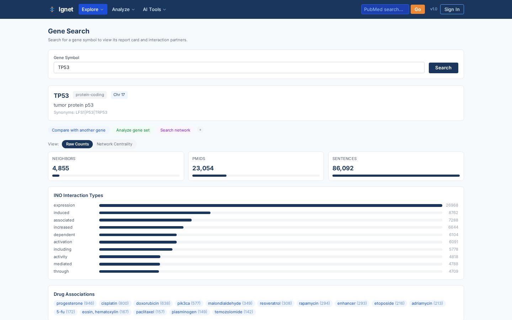

**GenePair analysis** — for any two genes, see all PubMed sentences where they
co-occur, ranked by BioBERT interaction confidence. Below: TP53 ↔ MDM2.

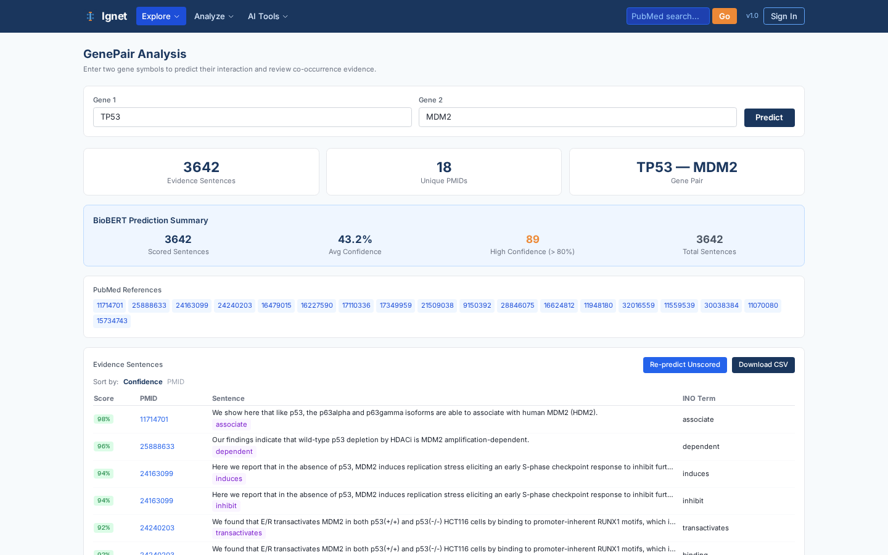

**Explore** — browse the most-connected genes in the database without needing
a search query first.

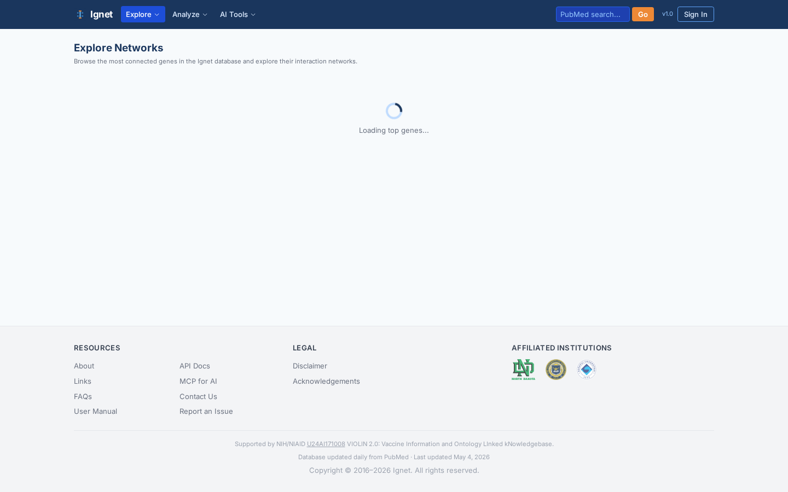

**INO Explorer** — browse the Interaction Network Ontology (~800 standardized
interaction-type terms) and pivot to the genes annotated with each term.

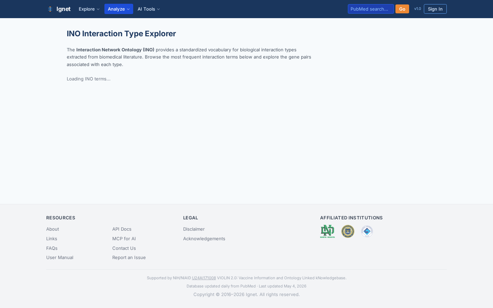

### Network construction and comparison

**Dignet** — the flagship network builder. Type any PubMed topic, get back a
Cytoscape force-directed graph of co-occurring genes, with an entity sidebar
(genes, drugs, diseases, vaccines) and GraphML/CSV export. Below: an example
network built from "influenza vaccine".

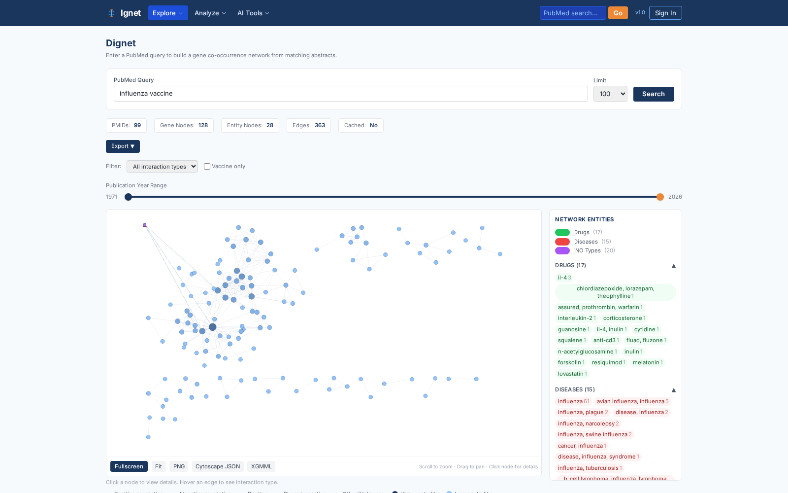

**Compare** — run two topics through the Dignet pipeline and see them
side-by-side, with shared/unique gene tables and a Venn diagram.

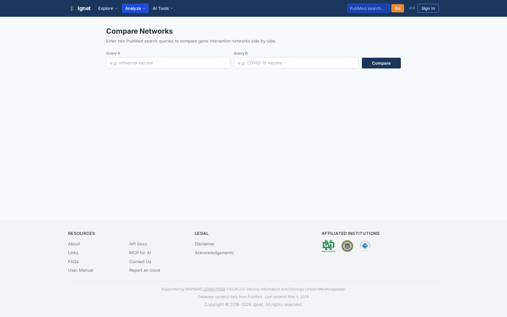

**Enrichment** — give it a gene list, get ranked drugs, diseases, and INO
terms most over-represented in the literature with hypergeometric p-values.
Below: a 10-gene tumor-suppressor set enriched against the database.

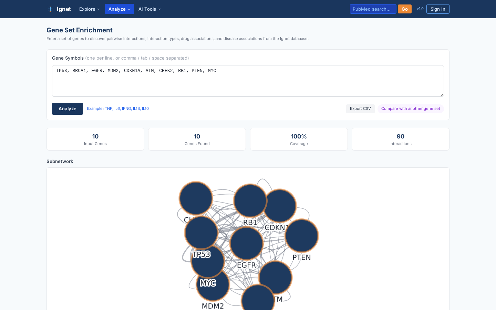

**Gene Set** — a persistent client-side gene cart that other tools (Enrichment,
BioSummarAI) can pick up from.

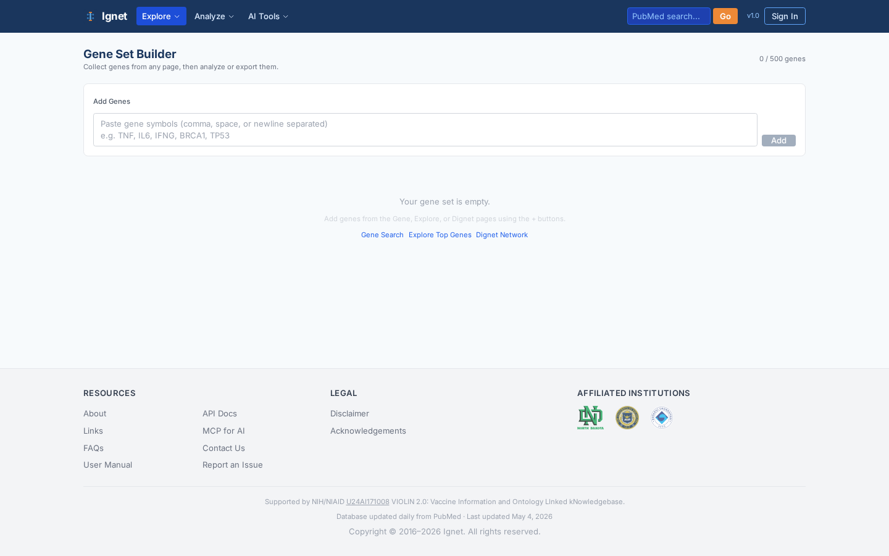

### AI-augmented tools

**BioSummarAI** — pick a gene list, get a GPT-4o-powered narrative summary of
their literature with PMID citations and chat-style follow-up.

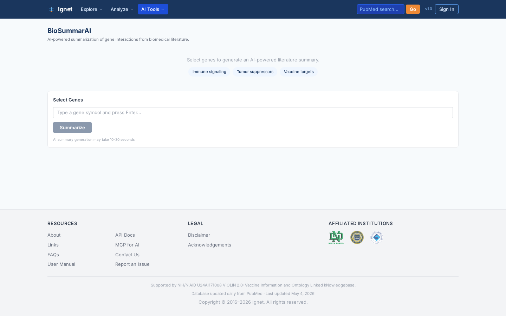

**Analyze Text** — paste any biomedical text; BioBERT identifies the gene
mentions and predicts whether each pair interacts.

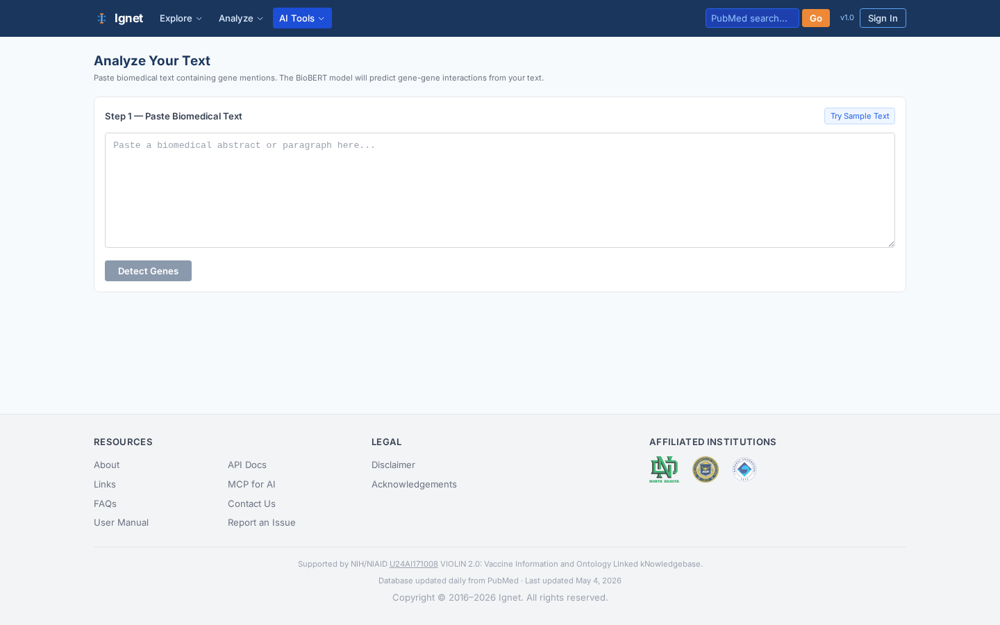

**Literature Assistant** — ask a natural-language question; the assistant
retrieves matching evidence from the database, passes it to GPT-4o with
citation-forcing instructions, and renders an answer where every claim
links to a PMID.

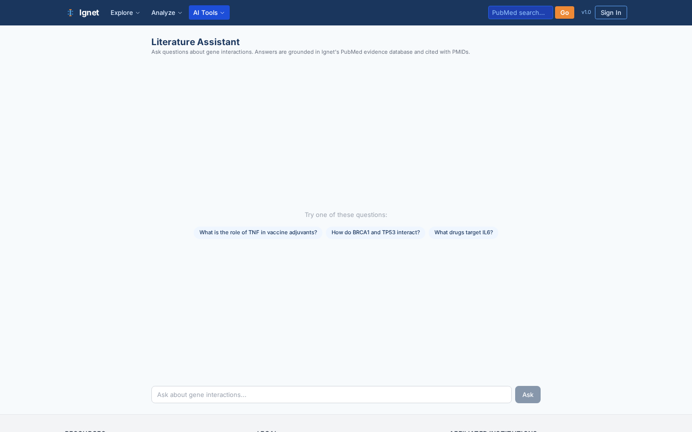

**Report** — download a multi-section HTML report (network image, evidence
table, AI summary) for a query.

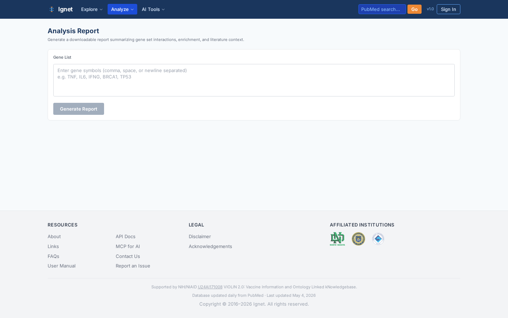

### Reference and onboarding

**API Docs** — live endpoint catalog with example payloads. This page also
documents the MCP setup for AI clients.

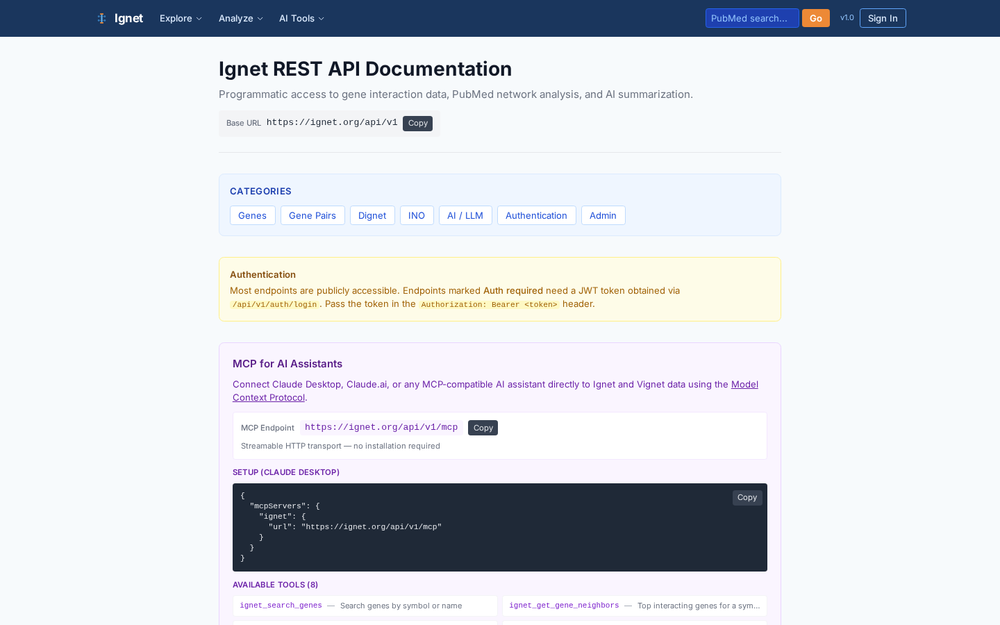

**About** — team, PI profiles, affiliations.

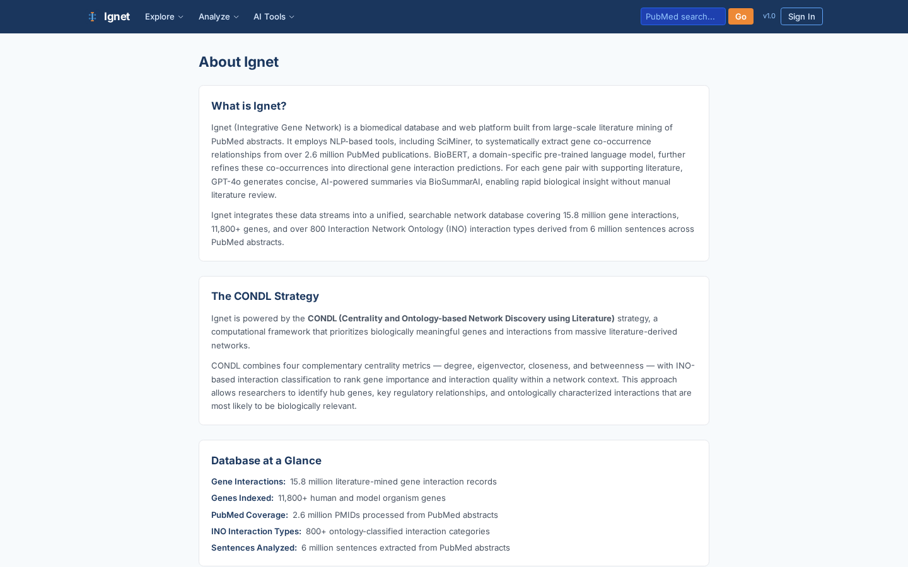

**FAQs** — questions users actually ask.

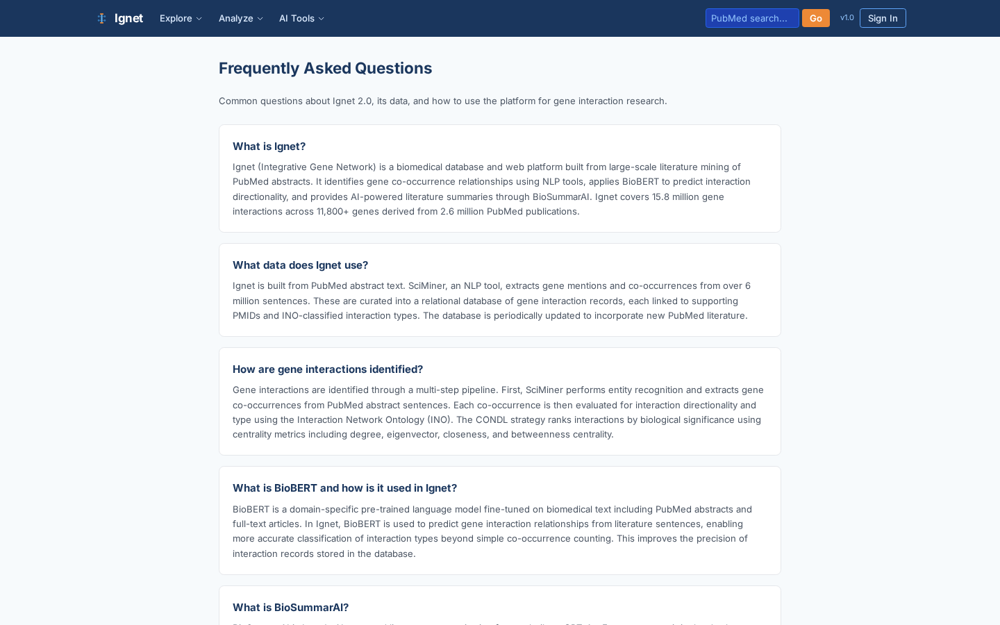

Static pages **Contact**, **Links**, **Disclaimer**, **Acknowledgements**, and
**Login** round out the SPA.

---

## Use case walkthroughs

Each walkthrough is concrete: a real research question, the exact
button-clicks (or URL), and the kind of insight you get.

### Walkthrough 1 — Cancer driver gene neighborhood (TP53)

**Research question.** What other genes do PubMed papers most often mention
alongside TP53 (the canonical tumor-suppressor gene), and what does the
evidence look like?

**Steps.**

1. Open <https://ignet.org/ignet/gene?q=TP53>.
2. The page renders three blocks:
   - **Report card** — synonyms, gene product, top diseases.
   - **Top neighbors table** — ranked by literature co-occurrence count.
   - **Induced subnetwork** — Cytoscape force-directed layout of TP53 and its
     top neighbors.
3. Click **MDM2** (the canonical negative regulator of TP53).
4. The GenePair page opens with TP53 ↔ MDM2 pre-loaded; you see the actual
   PubMed sentences that co-mention both genes, each with a BioBERT
   interaction-prediction score in [0, 1] and a clickable PMID.

**Why it matters.** You went from "TP53" to a ranked list of literature
partners and BioBERT-scored evidence in three clicks. Doing the same by manual
PubMed querying would take hours of search-and-skim.

### Walkthrough 2 — Drug-target enrichment for a custom gene set

**Research question.** I have a 10-gene tumor-suppressor signature from
RNA-seq. Which drugs in DrugBank are most over-represented in PubMed when
researchers write about these genes? Which diseases?

**Steps.**

1. Open <https://ignet.org/ignet/enrichment>.
2. Paste your gene list (one per line, or comma-separated):
   ```
   TP53, BRCA1, EGFR, MDM2, CDKN1A, ATM, CHEK2, RB1, PTEN, MYC
   ```
3. Hit **Analyze**. The page calls `POST /api/v1/enrichment/analyze` and
   returns three ranked tables:
   - **Drug enrichment** — drugs co-mentioned with the most of your input
     genes, with hypergeometric p-values.
   - **Disease enrichment** — disease terms (Human Disease Ontology) similarly
     ranked.
   - **INO enrichment** — interaction-type terms (phosphorylation, binding,
     activation, etc.).
4. Click any row to drill into the underlying PMIDs.

**Why it matters.** Pathway databases (KEGG, Reactome) tell you what's
*supposed* to interact; literature-mined enrichment tells you what's
*actually being studied together*. Drug rows are particularly novel —
DrugBank itself doesn't expose gene-set associations.

### Walkthrough 3 — Literature comparison between two contexts

**Research question.** Do "neurodegeneration" and "aging" share a gene
signature in the literature? Or are they discussed in mostly different
contexts?

**Steps.**

1. Open <https://ignet.org/ignet/compare>.
2. Enter two queries:
   - Query 1: `neurodegeneration`
   - Query 2: `aging`
3. Hit **Compare**. The page runs both queries through the Dignet pipeline
   (PubMed → mined sentences → gene pairs) and displays:
   - Two networks **side-by-side** (color-coded).
   - A **Venn diagram** of unique vs. shared genes.
   - A ranked **shared gene pairs** table, sortable by literature support.
4. Export the shared gene list to use in Walkthrough 2.

**Why it matters.** Systematic-review-style comparisons that normally require
weeks of manual literature curation become a 30-second query.

### Walkthrough 4 — Evidence-grounded literature Q&A

**Research question.** Which genes are most strongly linked to inflammasome
activation in the context of sepsis?

**Steps.**

1. Open <https://ignet.org/ignet/assistant>.
2. Type the question verbatim and hit **Ask**.
3. The Assistant:
   - Parses the question with GPT-4o into structured filters.
   - Retrieves matching rows from `t_sentences` joined with `t_gene_pairs`
     and the relevant annotation tables.
   - Constructs a citation-forcing prompt for GPT-4o.
   - Renders an answer where **every claim has an inline PMID badge**.
4. Click any PMID to expand the underlying sentence and BioBERT score.

**Why it matters.** Unlike a generic LLM that may hallucinate, the
Assistant only synthesizes from indexed evidence — every assertion is
auditable.

---

## REST API

Ignet exposes a fully-featured REST API at `https://ignet.org/api/v1/`.
All read endpoints are **open** (no API key needed) and there's a soft
rate limit of ~100 req/min per IP.

### curl examples

```bash
# Database health
curl -s https://ignet.org/api/v1/health

# Aggregate stats including the data-currency label
curl -s https://ignet.org/api/v1/stats | python3 -m json.tool

# Gene search (returns IDs, symbols, synonyms)
curl -s "https://ignet.org/api/v1/genes/search?query=BRCA1&limit=5"

# Top co-occurring partners for a gene
curl -s "https://ignet.org/api/v1/genes/neighbors?gene=TP53&limit=20"

# Gene-pair evidence with BioBERT scores
curl -s "https://ignet.org/api/v1/pairs/pair?gene1=TP53&gene2=MDM2&limit=10"

# Enrichment analysis (POST with JSON body)
curl -s -X POST https://ignet.org/api/v1/enrichment/analyze \
  -H "Content-Type: application/json" \
  -d '{"genes": ["TP53","BRCA1","EGFR","MDM2","CDKN1A"]}'

# Build a Dignet network from a PubMed query
curl -s "https://ignet.org/api/v1/dignet/search?q=influenza+vaccine&max_pmids=200"

# INO interaction-type catalog
curl -s https://ignet.org/api/v1/ino/terms

# BioBERT prediction on a custom sentence
curl -s -X POST https://ignet.org/api/v1/pairs/predict \
  -H "Content-Type: application/json" \
  -d '{"sentence":"TP53 directly binds and inhibits MDM2","gene1":"TP53","gene2":"MDM2"}'
```

### Python client examples

The API speaks plain JSON — no SDK required. Here's a copy-pasteable client
class for the most common operations.

```python
"""ignet_client.py — minimal Python wrapper for the Ignet REST API."""
from __future__ import annotations
import requests
from typing import Iterable

class IgnetClient:
    def __init__(self, base_url: str = "https://ignet.org/api/v1") -> None:
        self.base = base_url.rstrip("/")
        self.session = requests.Session()

    def _get(self, path: str, **params) -> dict:
        r = self.session.get(f"{self.base}/{path.lstrip('/')}", params=params, timeout=30)
        r.raise_for_status()
        return r.json()

    def _post(self, path: str, json: dict) -> dict:
        r = self.session.post(f"{self.base}/{path.lstrip('/')}", json=json, timeout=60)
        r.raise_for_status()
        return r.json()

    def stats(self) -> dict:
        return self._get("stats")

    def gene_search(self, query: str, limit: int = 10) -> dict:
        return self._get("genes/search", query=query, limit=limit)

    def gene_neighbors(self, gene: str, limit: int = 20) -> dict:
        return self._get("genes/neighbors", gene=gene, limit=limit)

    def pair_evidence(self, gene1: str, gene2: str, limit: int = 50) -> dict:
        return self._get("pairs/pair", gene1=gene1, gene2=gene2, limit=limit)

    def enrichment(self, genes: Iterable[str]) -> dict:
        return self._post("enrichment/analyze", json={"genes": list(genes)})

    def dignet(self, query: str, max_pmids: int = 200) -> dict:
        return self._get("dignet/search", q=query, max_pmids=max_pmids)


if __name__ == "__main__":
    c = IgnetClient()
    print("Data through:", c.stats()["data_last_updated"])

    # Top 5 neighbors of TP53
    for n in c.gene_neighbors("TP53", limit=5)["neighbors"][:5]:
        print(f"  TP53 ↔ {n['gene']}  (PMIDs: {n['count']})")

    # Drug enrichment for a custom signature
    enr = c.enrichment(["TP53", "BRCA1", "EGFR", "MDM2", "CDKN1A"])
    for d in enr["drugs"][:5]:
        print(f"  Drug: {d['name']}  overlap={d['overlap']}  p={d['pvalue']:.2e}")
```

### JavaScript client examples

```javascript
// Browser or Node 18+ (uses native fetch)

const IGNET = "https://ignet.org/api/v1";

async function igGet(path, params = {}) {
  const qs = new URLSearchParams(params).toString();
  const url = `${IGNET}/${path}${qs ? `?${qs}` : ""}`;
  const r = await fetch(url);
  if (!r.ok) throw new Error(`${r.status} ${r.statusText} on ${url}`);
  return r.json();
}

async function igPost(path, body) {
  const r = await fetch(`${IGNET}/${path}`, {
    method: "POST",
    headers: { "Content-Type": "application/json" },
    body: JSON.stringify(body),
  });
  if (!r.ok) throw new Error(`${r.status} ${r.statusText}`);
  return r.json();
}

// Examples
const stats     = await igGet("stats");
const neighbors = await igGet("genes/neighbors", { gene: "TP53", limit: 10 });
const evidence  = await igGet("pairs/pair", { gene1: "TP53", gene2: "MDM2" });
const enrich    = await igPost("enrichment/analyze",
                               { genes: ["TP53","BRCA1","EGFR"] });

console.log("Data through:", stats.data_last_updated);
```

For the full endpoint catalog, hit <https://ignet.org/ignet/api-docs> in a
browser; it's a live, self-documenting tour.

---

## MCP — Model Context Protocol

Ignet publishes a **public MCP endpoint** at `https://ignet.org/api/v1/mcp`
that implements the [Model Context Protocol](https://spec.modelcontextprotocol.io/)
over Streamable HTTP / JSON-RPC 2.0. This lets any MCP-aware AI assistant
call Ignet as a first-class tool.

### Tools exposed

| Tool | What it does |
|---|---|
| `ignet_search_genes` | Search for genes by symbol, name, or synonym |
| `ignet_get_gene_neighbors` | Top co-occurring partners for a gene |
| `ignet_get_gene_pair_evidence` | Evidence sentences for a gene pair with BioBERT scores |
| `ignet_get_stats` | Database-wide counters and data-currency |
| `ignet_get_enrichment` | Drug / disease / INO enrichment for a gene list |
| `vignet_search_vaccines` | Search the Vaccine Ontology (Vignet bridge) |
| `vignet_get_vaccine_genes` | Genes associated with a vaccine (Vignet bridge) |
| `vignet_get_vaccine_stats` | Vaccine-scoped counters (Vignet bridge) |

### Connecting Claude Desktop

1. Open `claude_desktop_config.json` (`Settings → Developer → Edit Config`).
2. Add the `ignet` server entry under `mcpServers`:

   ```json
   {
     "mcpServers": {
       "ignet": {
         "url": "https://ignet.org/api/v1/mcp",
         "transport": "streamable-http"
       }
     }
   }
   ```

3. Restart Claude Desktop.
4. Verify by asking Claude: *"What tools does the ignet server expose?"* —
   Claude will list all 8.

### Example queries to try

> *"Using ignet, give me the top 10 genes that co-occur with BRCA1 in
> PubMed, and for each, summarize what the literature says they do."*

> *"Run an enrichment analysis on these genes: TNF, IL6, IL1B, NLRP3. Which
> drugs and diseases are most associated with them?"*

> *"Find the strongest BioBERT-scored sentence that describes a TP53 ↔ MDM2
> interaction, then explain why it matters for cancer therapy."*

Claude (or any MCP-aware assistant) will automatically (a) discover the
tools, (b) call them, (c) cite the PMIDs in its answer.

### Raw MCP call

If you want to invoke the protocol manually:

```bash
# List available tools
curl -s -X POST https://ignet.org/api/v1/mcp \
  -H "Content-Type: application/json" \
  -d '{"jsonrpc":"2.0","id":1,"method":"tools/list","params":{}}'

# Call a tool
curl -s -X POST https://ignet.org/api/v1/mcp \
  -H "Content-Type: application/json" \
  -d '{
    "jsonrpc":"2.0","id":2,
    "method":"tools/call",
    "params":{
      "name":"ignet_get_gene_neighbors",
      "arguments":{"gene":"TP53","limit":10}
    }
  }'
```

---

## System architecture

```
                                Internet
                                   │
                              ┌────▼─────┐
                              │ Apache   │  TLS, /ignet/, /vignet/, /api/v1/
                              │ :443     │
                              └─┬──┬───┬─┘
                  ┌─────────────┘  │   └─────────────┐
                  │                │                 │
        ┌─────────▼─────────┐  ┌───▼──────────────┐  │
        │ Ignet 2.0 SPA      │  │ Vignet SPA       │  │
        │ React 19 + Vite 8 │  │ (same stack)     │  │
        │ 21 pages           │  │ 14 pages         │  │
        └─────────┬──────────┘  └────────┬─────────┘  │
                  │  fetch /api/v1/*     │            │
                  └──────────┬───────────┘            │
                             │                        │
                  ┌──────────▼────────────────────────▼──┐
                  │       Flask + Waitress API           │
                  │       127.0.0.1:9637                 │
                  │  12 route files in api/routes/       │
                  └────┬───────────┬──────────┬──────────┘
                       │           │          │
              ┌────────▼──┐  ┌─────▼─────┐  ┌─▼────────────┐
              │ MariaDB    │  │ Redis      │  │ AI services  │
              │ db=ignet   │  │ stats      │  │ BioBERT :9635│
              │ 17 tables  │  │ cache 24h │  │ BioSummarAI  │
              │            │  │            │  │ :9636        │
              └────────────┘  └────────────┘  └──────┬───────┘
                                                     │
                                            ┌────────▼──────┐
                                            │ OpenAI GPT-4o │
                                            └────────────────┘
```

**Two SPAs, one database.** Both Ignet and [Vignet](https://github.com/hurlab/Vignet)
read the same `MariaDB.ignet` database via the same Flask API. They differ
only in the React build the browser receives. The Vignet "view" is a
query-time projection that constrains by `t_vo` membership and walks the
`t_vo_hierarchy` tree to aggregate child-vaccine evidence.

For a full architecture document, see [`docs/IGNET_VIGNET_INTRODUCTION.md`](docs/IGNET_VIGNET_INTRODUCTION.md).

---

## Data pipeline

Ignet's freshness comes from an automated **daily PubMed update pipeline**
that lives at `/home/juhur/IgnetDailyUpdate/` on the production server. It
runs from `cron` at 02:00 local time and processes one NCBI PubMed update
file per loop iteration to completion before reaching for the next.

### Pipeline stages

1. **Download** one update file (`pubmed26nNNNN.xml.gz`) from
   `ftp.ncbi.nlm.nih.gov/pubmed/updatefiles/`. Tracker
   `last_processed_number.txt` ensures we don't re-process old files.
2. **Preprocess** the XML through nine engine stages: extract PMIDs, organize
   per-PMID details, split sentences, assign global sentence IDs, build
   sentence-ID → PMID index, etc.
3. **Mine** the parsed sentences with five named filters:
   - Host (gene) — gene-name mining
   - VO (vaccine) — vaccine-name mining
   - HDO (disease) — disease-name mining (Regexp::Trie compiled regex, 2,372× faster than per-term iteration)
   - DrugBank (drug) — drug-name mining
   - INO (interaction) — interaction-type mining (runs last to leverage entity filters)
4. **Score** every gene pair with BioBERT (port 9635) for interaction confidence.
5. **Generate** within-file co-occurrence pairs across six entity-pair types
   (VO-Gene, VO-Drug, VO-HDO, Drug-Gene, Drug-HDO, HDO-Gene).
6. **UPSERT** into MariaDB via a DELETE-then-LOAD pattern on PMID batches.

### Redundancy avoidance (four layers)

This is what makes daily updates safe to run unattended:

| Layer | Mechanism | What it guarantees |
|---|---|---|
| **File-level** | `last_processed_number.txt` only advances on success; runtime assertions abort if it doesn't advance between iterations | Never skip a file; never re-process a successfully loaded file |
| **PMID-level** | Before LOAD: `DELETE` all rows for the PMIDs in the current file from six mining tables | Revised abstracts atomically replace stale annotations |
| **Sentence-level** | Sentence IDs allocated as `MAX(sentence_id) + 1` per file | Sentence IDs never collide |
| **Process-level** | PID-based lock file (`.pipeline.lock`) with auto-release on EXIT trap | No concurrent cron invocations; crashes don't strand the lock |

### Failure-mode behavior

| Failure | Tracker | DB state | Recovery |
|---|---|---|---|
| Download fails | not advanced | untouched | next cron retries same file |
| Mining fails | not advanced | untouched | next cron re-mines |
| BioBERT fails | n/a (non-fatal) | `score = NULL` for new rows | backfill possible later |
| DB DELETE OK, LOAD fails | not advanced | partial | next cron re-DELETEs (no-op) and re-LOADs |
| Process crashes | not advanced | locked file auto-released by trap | next cron retries |
| Concurrent cron | n/a | untouched | second invocation exits via lock |

A more detailed pipeline reference (with code-level citations) is in
[`docs/IGNET_VIGNET_INTRODUCTION.md` §7](docs/IGNET_VIGNET_INTRODUCTION.md#7-daily-pubmed-update-pipeline).

---

## Self-hosting

You don't need to self-host to *use* Ignet — the live site is open. Self-hosting
makes sense if you want to fork, extend, run against private literature, or
mirror the database internally.

### Prerequisites

- **Node.js 22+** (for the React frontend; tested on 24.9 in production)
- **Python 3.12+** (for the Flask API)
- **MariaDB 10.6+** (drop-in for MySQL 8 semantics)
- **Redis 7+** (optional but recommended — 24h cache for stats)
- **Apache 2.4+** or Nginx (production reverse proxy with TLS)
- ~50 GB disk for the database (5 M+ rows in the largest tables)
- ~16 GB RAM (8 GB for MariaDB InnoDB buffer pool; the rest for Python + Node)

### Local development

```bash
# 1. Clone
git clone https://github.com/hurlab/Ignet.git
cd Ignet

# 2. Frontend
cd frontend
npm install
npm run dev           # Vite dev server on http://localhost:5173
# OR production build:
npm run build         # emits to ../dist-react/

# 3. Backend
cd ../api
python3 -m venv venv
source venv/bin/activate
pip install -r requirements.txt
# Configure env (see Environment variables section below)
python run.py         # Waitress on http://localhost:9637

# 4. Database (import schema dump)
mysql -u root -p ignet < ../scripts/schema_ignet.sql
# (Bulk data load is server-specific; contact maintainers for transfer files)
```

The Vite dev server proxies `/api/v1/*` to the Flask backend; set
`VITE_API_PROXY_TARGET=http://127.0.0.1:9637` in `frontend/.env` if your
backend runs on a different port.

### Production deployment

Production runs **systemd** services behind **Apache** with TLS. There is no
Docker or Vercel pathway — those references were aspirational in earlier
versions of this README and have been removed.

Example systemd unit for the API (`/etc/systemd/system/ignet-api.service`):

```ini
[Unit]
Description=Ignet REST API
After=network.target mariadb.service redis.service

[Service]
Type=simple
User=ignet
WorkingDirectory=/opt/ignet/api
ExecStart=/opt/ignet/api/venv/bin/python run.py
EnvironmentFile=/opt/ignet/biosummarAI/.env
Environment=PYTHONUNBUFFERED=1
Restart=on-failure
RestartSec=5

[Install]
WantedBy=multi-user.target
```

Similar units exist for `ignet-biobert.service` (port 9635) and
`ignet-biosummarai.service` (port 9636).

Apache reverse-proxies `/api/v1/*` to `127.0.0.1:9637` and serves the SPA
from `dist-react/`. A `.htaccess` in `dist-react/` provides the SPA fallback:

```apache
Options -MultiViews
DirectoryIndex index.html
<IfModule mod_rewrite.c>
  RewriteEngine On
  RewriteCond %{REQUEST_FILENAME} !-f
  RewriteCond %{REQUEST_FILENAME} !-d
  RewriteRule ^ index.html [L]
</IfModule>
```

### Environment variables

Create `biosummarAI/.env`. The API loads this on startup via
`EnvironmentFile=` in the systemd unit.

```bash
# Database
DB_HOST=localhost
DB_USER=ignet
DB_PASSWORD=<set-me>
DB_DATABASE=ignet

# OpenAI (for BioSummarAI / Assistant)
OPENAI_API_KEY=sk-...

# Auth — MUST be stable across restarts.
# Generate ONCE with the helper and persist; rotating these invalidates
# all sessions and makes BYOK keys unreadable.
JWT_SECRET=<run: scripts/generate_secrets.sh>
FERNET_KEY=<run: scripts/generate_secrets.sh>

# Pipeline tracker (used by /api/v1/stats to surface the data-currency label)
IGNET_PIPELINE_TRACKER=/var/lib/ignet/last_processed_number.txt
IGNET_PUBMED_FILE_DIR=/var/lib/ignet/pubmed-files

# Optional: NCBI key for higher esearch/efetch rate limits
NCBI_API_KEY=
```

Helper to generate JWT and Fernet secrets:

```bash
bash scripts/generate_secrets.sh >> biosummarAI/.env
```

---

## Database schema

The full schema is in [`scripts/schema_ignet.sql`](scripts/schema_ignet.sql).
Highlights of the 17 core tables (post-`pubmed26n` migration, **snake_case**):

| Table | Rows | What it stores |
|---|---:|---|
| `t_gene_pairs` | 5,124,468 | Gene pair co-mentions (PK `id`, FK `sentence_id` → `t_sentences`, BioBERT `score`) |
| `t_sentences` | 1,898,655 | Evidence sentences with ≥2 gene mentions |
| `t_ino` | 42,578,113 | INO interaction-type annotations |
| `t_vo` | 586,455 | Vaccine Ontology annotations |
| `t_drug` | 7,071,575 | DrugBank annotations |
| `t_hdo` | 18,817,630 | Human Disease Ontology annotations |
| `t_vo_hierarchy` | 6,796 | VO ontology tree (parent-child) |
| `t_vo_has_gene_data` | 666 | VO IDs with any gene evidence (including ancestors) |
| `t_cooccurrence_vo_gene` | 7,960 | Vaccine ↔ gene edges |
| `t_cooccurrence_vo_drug` | 6,495 | Vaccine ↔ drug edges |
| `t_cooccurrence_vo_hdo` | 9,990 | Vaccine ↔ disease edges |
| `t_cooccurrence_drug_gene` | 178,784 | Drug ↔ gene edges |
| `t_cooccurrence_drug_hdo` | 167,691 | Drug ↔ disease edges |
| `t_cooccurrence_hdo_gene` | 292,949 | Disease ↔ gene edges |

Naming convention: all 2.0 columns use **snake_case**
(`pmid`, `sentence_id`, `gene_symbol1`, `gene_match1`, `score`,
`has_vaccine`, `ino_id`, `vo_id`). The 2026-03 migration from CamelCase
is documented in [`scripts/01_rename_tables.sql`](scripts/01_rename_tables.sql).

---

## Performance and benchmarks

| Operation | Typical latency |
|---|---|
| `/api/v1/stats` (cached) | ~5 ms |
| `/api/v1/genes/neighbors?gene=TP53` | ~80 ms |
| `/api/v1/pairs/pair?gene1=…&gene2=…` (paged) | ~120 ms |
| `/api/v1/enrichment/analyze` (10-gene list) | ~400 ms |
| `/api/v1/dignet/search?q=…` (network build, 200 PMIDs) | ~3–8 s |
| MCP `tools/list` | ~10 ms |
| Daily pipeline (one PubMed update file) | ~20 min end-to-end |
| HDO matching with `Regexp::Trie` vs. per-term iteration | **2,372×** speedup |

InnoDB tuning in use: `innodb_buffer_pool_size=4G`, `innodb_log_file_size=512M`.

---

## FAQ

**Q. Are the gene interactions in Ignet experimentally validated?**
No. Ignet extracts co-occurrence patterns from PubMed abstracts and scores
them with BioBERT for *predicted* interaction likelihood. Every result is
linked back to its source PMID so you can verify in the primary literature.
Treat Ignet as a hypothesis-generation tool, not a curated database.

**Q. How is Ignet different from STRING, GeneMANIA, or PubTator?**
STRING and GeneMANIA aggregate curated databases and computational
predictions; they update on a release schedule, not daily. PubTator
annotates entities but doesn't build queryable interaction networks.
Ignet (a) mines raw PubMed abstracts at sentence-level granularity,
(b) scores every pair with BioBERT, (c) ships an MCP endpoint for AI
assistants, and (d) updates daily.

**Q. What's the latency between a PubMed paper appearing and Ignet
seeing it?**
NCBI releases update files daily, typically within a few days of indexing.
The pipeline runs at 02:00 local each day. End-to-end, expect ~2–4 days
from PubMed indexing to Ignet visibility.

**Q. Can I run Ignet against private (not-yet-published) literature?**
Yes — fork the repo and point the pipeline at your own XML files. The
mining engine (`/home/juhur/IgnetDailyUpdate/sciminer_engine/`) accepts
PubMed-format XML.

**Q. Is there a Python SDK?**
Not yet — the API is plain JSON, so a 30-line wrapper is enough (see
[Python client examples](#python-client-examples)). A formal SDK is on
the roadmap.

**Q. What does BioBERT actually score?**
For each sentence containing two gene mentions, BioBERT replaces the
mentions with `PROTEIN1` / `PROTEIN2`, optionally brackets interaction
verbs with `[INT]…[/INT]`, and outputs a sigmoid confidence in
[0, 1] for whether the sentence describes a protein-protein interaction.
Model: [`metalrt/ignet-biobert`](https://huggingface.co/metalrt/ignet-biobert).

**Q. What's the relationship between Ignet and Vignet?**
Vignet is a sister site at <https://ignet.org/vignet/> with a
vaccine-focused information architecture. It runs against the **same**
database and the **same** Flask API. The repo is at
<https://github.com/hurlab/Vignet>.

**Q. How do I cite Ignet in a paper?**
See [Citation](#citation) below.

---

## Troubleshooting

**The Assistant returns "no evidence found."**
The Assistant only synthesizes from indexed sentences. If your question is
very narrow or about a topic with sparse PubMed coverage, try broadening
the query or use Dignet to confirm there's literature on the topic at all.

**API returns 429 (rate limit).**
Soft limit is ~100 req/min per IP. For heavier use, batch your requests or
reach out via [contact](#contact) for a private deployment.

**Self-hosted: `data_last_updated` returns `null` in `/api/v1/stats`.**
Check `IGNET_PIPELINE_TRACKER` and `IGNET_PUBMED_FILE_DIR` in
`biosummarAI/.env` and confirm the tracker file exists and contains a
valid integer.

**Self-hosted: SPA returns 404 on direct route navigation (e.g., `/gene`).**
You're missing the SPA `.htaccess` rewrite. Copy
`dist-react/.htaccess` from the repo into your `dist-react/` deploy.

**MCP: Claude Desktop says "tools/list failed."**
Verify with the raw curl from [MCP — Model Context Protocol](#mcp--model-context-protocol).
If that works but Claude Desktop doesn't, restart the desktop app and
double-check `transport` is `streamable-http` (not `stdio`).

---

## Roadmap

- [ ] **PMC full-text mining** — extend beyond abstracts to PubMed Central
      open-access full text.
- [ ] **Graph embedding-based search** — pre-trained node embeddings for
      similarity search across the heterogeneous knowledge graph.
- [ ] **Explicit causality models** — go beyond co-occurrence to extract
      directional regulatory relationships.
- [ ] **Cytoscape Desktop export** — direct `.cys` export for downstream
      analysis.
- [ ] **More ontologies** — Gene Ontology, Reactome, KEGG pathway terms.
- [ ] **Python SDK** — published `pip install ignet-client`.
- [ ] **Citation-DOI Zenodo workflow** — formal DOI per release.
- [ ] **Self-host quickstart** — Docker Compose bundle with a sample dataset.

---

## Related projects

- **[Vignet](https://github.com/hurlab/Vignet)** — vaccine-focused sister
  site running on the same backend.
- **[VIOLIN](http://www.violinet.org/)** — comprehensive vaccine information
  and ontology knowledge base (funded by the same NIH grant).
- **[BioBERT](https://github.com/dmis-lab/biobert)** — biomedical BERT model
  underpinning Ignet's interaction scoring.
- **[Interaction Network Ontology (INO)](https://github.com/INO-ontology/ino)** —
  standardized vocabulary for molecular interactions.
- **[Vaccine Ontology (VO)](https://github.com/vaccineontology/VO)** —
  Vignet's organizing ontology.
- **[Model Context Protocol](https://spec.modelcontextprotocol.io/)** —
  the protocol Ignet's MCP endpoint implements.

---

## Citation

If you use Ignet in published work, please cite:

```bibtex
@misc{ignet2026,
  title        = {Ignet: An Integrative Gene Network Database Constructed from
                  PubMed Literature with BioBERT Scoring and a Public MCP Endpoint},
  author       = {Hur, Junguk and He, Yongqun and Ozgur, Arzucan},
  year         = {2026},
  howpublished = {\url{https://ignet.org/ignet/}},
  note         = {Public release 2026-04-14;
                  supported by NIH/NIAID U24AI171008 (VIOLIN 2.0)}
}
```

Example in-text citation:

> "Gene interaction networks were derived using Ignet, an integrative
> gene-network database mined from 848,456 PubMed abstracts with BioBERT-based
> protein-interaction scoring (Hur et al., 2026). The database (`pubmed26n`,
> through May 2026) comprises 5.1 M gene-gene co-occurrence pairs and
> 1.9 M evidence sentences, with ontology annotations from INO, DrugBank, HDO,
> and the Vaccine Ontology."

---

## Funding

- **NIH/NIAID U24AI171008** — VIOLIN 2.0 (Vaccine Information and Ontology
  Linked kNowledgebase)
- University of North Dakota — Department of Biomedical Sciences
- University of Michigan — Medical School
- Bogazici University — Department of Computer Engineering

---

## License

[MIT License](LICENSE). Ignet data is derived from publicly available PubMed
abstracts and ontology resources, and is provided as-is for research and
educational purposes. Always verify findings in primary literature before
acting on them.

---

## Contact

- **Live site:** <https://ignet.org/ignet/>
- **Issues:** <https://github.com/hurlab/Ignet/issues>
- **Email:** <hurlabshared@gmail.com>
- **User manual:** [`docs/USER_MANUAL.md`](docs/USER_MANUAL.md)
- **Manuscript-prep introduction:** [`docs/IGNET_VIGNET_INTRODUCTION.md`](docs/IGNET_VIGNET_INTRODUCTION.md)
  / [HTML version](docs/IGNET_VIGNET_INTRODUCTION.html)
- **API docs (live):** <https://ignet.org/ignet/api-docs>

---

## Team

- **Junguk Hur, Ph.D.** — Lab PI, University of North Dakota (Biomedical Sciences)
- **Yongqun "Oliver" He, Ph.D.** — Co-PI, University of Michigan (Medical School)
- **Arzucan Ozgur, Ph.D.** — NLP collaborator, Bogazici University (Computer Engineering)
- And the Hur Lab and contributors community

---

## Changelog

### 2.1.0 — 2026-04-14 (public release)

- **Repository made public** with full history rewrite, secret purge, and
  independent security audit.
- Added `scripts/generate_secrets.sh` for fork-and-deploy users.
- Documented the public MCP endpoint and all 8 tools.
- Pipeline tracker location made configurable via `IGNET_PIPELINE_TRACKER`.

### 2.0.0 — 2026-03 (Ignet 2.0 launch)

- Complete rewrite from PHP to **React 19 + Flask** SPA.
- Migrated database to `pubmed26n` (~848 K abstracts, May 2026 cut).
- Snake_case schema across all 17 core tables.
- Added Vignet sister site at <https://ignet.org/vignet/>.
- Added Literature Assistant (RAG), BioSummarAI, Analyze Text, Compare,
  Enrichment, INO Explorer, Gene Set, Report.
- New 30+ endpoint REST API and 8-tool MCP endpoint.
- Daily PubMed update pipeline with four-layer redundancy avoidance.
- Six heterogeneous co-occurrence tables enabling cross-entity networks.

### 1.0 — 2016

- Initial Ignet release in PHP with Dignet, Gene Search, GenePair.
- BioBERT-based gene extraction.
- PubMed mining of ~25 years of abstracts.

---

**Last updated:** 2026-05-12
**Database version:** `pubmed26n` (file 1434, May 4, 2026)
**Built with focus on research impact.**
