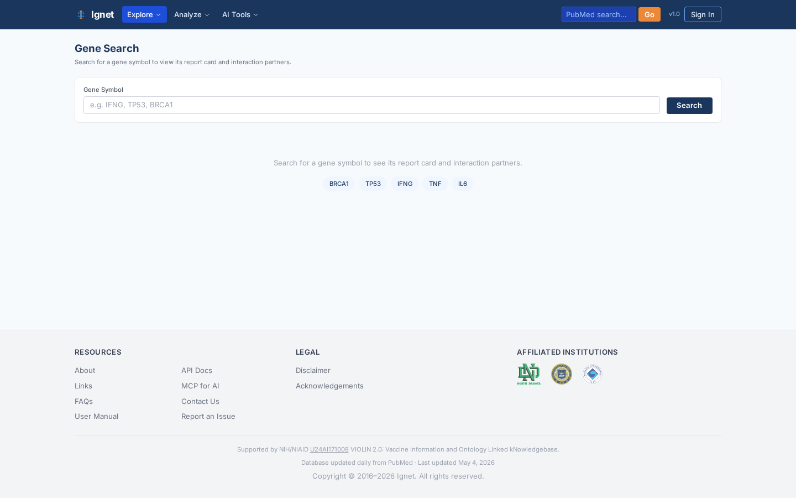
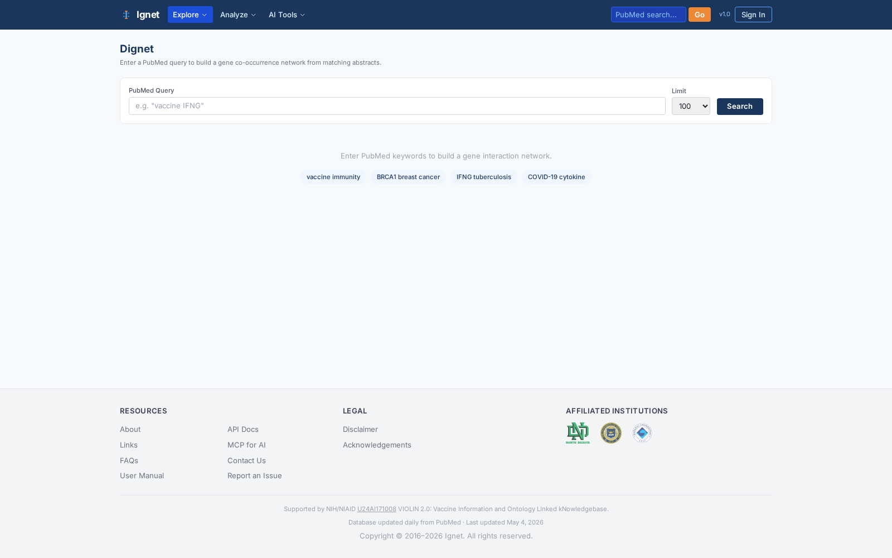
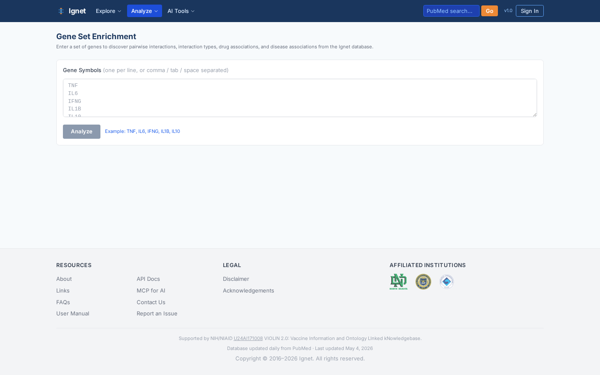

# Ignet 2.0 and Vignet — A Manuscript-Prep Introduction

> **For:** Sayed (manuscript preparation)
> **Author of source code:** Junguk Hur (PI) and contributors
> **Last refresh of this document:** 2026-05-12
> **Live sites:** <https://ignet.org/ignet/> and <https://ignet.org/vignet/>
> **Public GitHub:** <https://github.com/hurlab/Ignet>
> **NIH support:** NIAID U24AI171008 (VIOLIN 2.0)

This document is your single, deeply cross-referenced entry point into Ignet 2.0 and Vignet. It is structured for someone who must (a) understand the entire system without modifying it, and (b) lift figures, file paths, statistics, and methodological details directly into a manuscript. Every claim below points to a real file or table you can open and cite.


---

## Table of Contents

0. [Welcome and how to use this document](#0-welcome-and-how-to-use-this-document)
1. [Executive summary](#1-executive-summary)
2. [System architecture](#2-system-architecture)
3. [Frontend architecture (Ignet 2.0 and Vignet SPAs)](#3-frontend-architecture-ignet-20-and-vignet-spas)
4. [Backend API architecture (Flask + Waitress)](#4-backend-api-architecture-flask--waitress)
5. [AI and ML services](#5-ai-and-ml-services)
6. [Database architecture](#6-database-architecture)
7. [Daily PubMed update pipeline](#7-daily-pubmed-update-pipeline)
8. [Ontology integration](#8-ontology-integration)
9. [Use cases — Ignet 2.0](#9-use-cases--ignet-20)
10. [Use cases — Vignet](#10-use-cases--vignet)
11. [Programmatic access (REST API and MCP)](#11-programmatic-access-rest-api-and-mcp)
12. [Repositories, licensing, and open-science posture](#12-repositories-licensing-and-open-science-posture)
13. [Key locations cheat sheet](#13-key-locations-cheat-sheet)
14. [Suggested manuscript sections (writing guidance)](#14-suggested-manuscript-sections-writing-guidance)
15. [References and further reading](#15-references-and-further-reading)

---

## 0. Welcome and how to use this document

Sayed — you already know the pipeline end of this system. This document gives you the rest of it: the SPAs, the API, the database design, the ontology integration, and the use cases that justify Ignet 2.0 and Vignet as research products worth publishing. Read it linearly first; then revisit sections 7 (pipeline) and 9–10 (use cases) when you draft the methods and results.

**How to read this:**

- **Sections 1–2** give the 60-second pitch and the whole-system architecture. Lift the diagrams as Figure 1 in your manuscript.
- **Sections 3–5** detail what users see and what backs the SPAs. Use the screenshots; they are real production captures from `./screenshots/`.
- **Section 6** is the database. Memorize the seven core tables in §6.2.
- **Section 7** is your home territory — the daily pipeline — but it now also shows precisely how the pipeline avoids data redundancy (which is essential for the manuscript).
- **Sections 9–10** are use-cases written for figure captions. Each one names the page, the parameters, and the screenshot.
- **Section 14** sketches a methods section so you do not start from a blank page.

**Source-of-truth note:** PROJECT_HANDOFF.md (in the Ignet repo root, server-side only) and PROJECT_LOG.md (same place) are the live operational records. This intro is a stable, citation-ready snapshot.

---

## 1. Executive summary

**Ignet 2.0 — Integrative Gene Network.** An open-access web platform that turns 25+ years of PubMed literature into queryable, evidence-grounded gene interaction networks. Built on **5,124,468 BioBERT-scored gene pairs** drawn from **1,898,655 evidence sentences** across **848K+ PubMed abstracts**. Ignet 2.0 exposes 21 single-page tools (network builder, AI-grounded literature assistant, enrichment, comparison, etc.) plus a 30+ endpoint REST API and an 8-tool MCP endpoint that AI assistants (Claude Desktop, Claude.ai) can call directly.

**Vignet — Vaccine-focused Integrative Gene Network.** A sister application that re-frames the same literature stack around the **Vaccine Ontology (VO)**. Built on **586,455 vaccine annotations** linked to **6,796 VO terms** and the 5.1 M gene-pair backbone. Vignet exposes 14 SPA pages including VacNet (cross-entity vaccine-gene-drug-disease networks), VacPair (pairwise evidence), Compare (cross-vaccine), VacSummarAI (GPT-4o summarization), Vaccine Assistant (RAG over evidence), and the VO Ontology Explorer.

**Shared substrate.** Both SPAs are served by the **same** Flask + Waitress API at port 9637 against the **same** MariaDB schema (`ignet`). They differ only in the React build that the browser receives. The daily PubMed update pipeline keeps the substrate current via incremental UPSERTs into seven core tables and six co-occurrence tables, with multi-layer redundancy avoidance (§7.7).

**Key statistics (as of the May 2026 release):**

| Quantity | Value | Source table |
|---|---:|---|
| PubMed abstracts mined | ~848,000 | `t_gene_pairs` (distinct PMIDs) |
| Gene-gene co-occurrence pairs | 5,124,468 | `t_gene_pairs` |
| Evidence sentences (≥2 gene mentions) | 1,898,655 | `t_sentences` |
| INO interaction-type annotations | 42,578,113 | `t_ino` |
| Vaccine Ontology annotations | 586,455 | `t_vo` |
| DrugBank drug annotations | 7,071,575 | `t_drug` |
| Disease Ontology (HDO) annotations | 18,817,630 | `t_hdo` |
| Vaccine terms with gene evidence | 666 (of 6,796 VO) | `t_vo_has_gene_data` |
| Co-occurrence pairs (heterogeneous) | 663,869 | six `t_cooccurrence_*` tables |
| Latest processed PubMed file | `pubmed26n1434.xml.gz` (May 4, 2026) | `last_processed_number.txt` |

---

## 2. System architecture

### 2.1 Component map

The system has four tiers, all on a single Linux host (`hurlabvm1.med.und.edu`), fronted by Apache HTTPD and TLS.

```
                                Internet
                                   │
                              ┌────▼─────┐
                              │ Apache   │  TLS, vhost
                              │ httpd    │  routes /ignet/, /vignet/,
                              │ :443/:80 │  /api/v1/, /ignet_legacy/
                              └─┬──┬───┬─┘
                  ┌─────────────┘  │   └─────────────┐
                  │                │                 │
        ┌─────────▼─────────┐  ┌───▼──────────────┐  │
        │ Ignet 2.0 SPA      │  │ Vignet SPA       │  │
        │ /ignet/dist-react/ │  │ /vignet/dist-rea │  │
        │ React 19+Vite 8    │  │ ct/ (same stack) │  │
        │ 21 pages           │  │ 14 pages         │  │
        └─────────┬──────────┘  └────────┬─────────┘  │
                  │  fetch /api/v1/*     │            │
                  └──────────┬───────────┘            │
                             │                        │
                  ┌──────────▼────────────────────────▼──┐
                  │       Flask + Waitress API           │
                  │       127.0.0.1:9637                 │
                  │  12 route files in api/routes/       │
                  │  Blueprints: genes, pairs, dignet,   │
                  │  vaccine, enrichment, ino, assistant │
                  │  llm, mcp, stats, auth, admin        │
                  └────┬───────────┬──────────┬──────────┘
                       │           │          │
              ┌────────▼──┐  ┌─────▼─────┐  ┌─▼────────────┐
              │ MariaDB    │  │ Redis      │  │ AI services  │
              │ db=ignet   │  │ stats      │  │ BioBERT :9635│
              │ 17 tables  │  │ cache 24h │  │ BioSummarAI  │
              │            │  │            │  │ :9636        │
              └────────────┘  └────────────┘  └──────┬───────┘
                                                     │
                                            ┌────────▼──────┐
                                            │ OpenAI GPT-4o  │
                                            │ (BioSummarAI,  │
                                            │  Assistant)    │
                                            └────────────────┘

  ┌────────────────────────────────────────────────────────────┐
  │  Out-of-band: daily PubMed update pipeline (see §7)        │
  │  /home/juhur/IgnetDailyUpdate/ → cron 2 AM → MariaDB UPSERT│
  └────────────────────────────────────────────────────────────┘
```

### 2.2 Process and port inventory

| Service | Port | Process | Code location | Started by |
|---|---:|---|---|---|
| Apache HTTPD | 80, 443 | `httpd` | `/etc/httpd/conf/` (vhost) | systemd |
| Flask API | 9637 | `python api/run.py` (Waitress WSGI) | `/data/var/www/html/ignet/api/` | `systemctl restart ignet-api.service` |
| BioBERT predictor | 9635 | `python biobert_prediction.py` | `/data/var/www/html/ignet/genepair/bert_files/` | `ignet-biobert.service` |
| BioSummarAI | 9636 | `python api_biosummary.py` | `/data/var/www/html/ignet/biosummarAI/` | `ignet-biosummarai.service` |
| MariaDB | 3306 (local) | `mariadbd` | DB: `ignet` | systemd |
| Redis | 6379 (local) | `redis-server` | shared stats cache (24 h TTL) | systemd |
| Daily pipeline | n/a | `single_xml_pipeline.sh --download` | `/home/juhur/IgnetDailyUpdate/automation_scripts/` | `cron` (2 AM daily) |

### 2.3 Three SPAs (one stack)

| SPA | URL prefix | Build directory | Source | Pages |
|---|---|---|---|---|
| Ignet 2.0 | `/ignet/dist-react/` | `/data/var/www/html/ignet/dist-react/` | `/data/var/www/html/ignet/frontend/src/` | 21 |
| Vignet | `/vignet/dist-react/` | `/data/var/www/html/vignet/dist-react/` | `/data/var/www/html/vignet/frontend/src/` | 14 |
| Legacy PHP | `/ignet_legacy/` | n/a (PHP, server-rendered) | `/data/var/www/html/ignet_legacy/` | many |

The legacy site is preserved for citation continuity and is **not** part of the 2.0 manuscript. The two modern SPAs read the same JSON API and share `useDataLastUpdated` and other React hooks (each SPA keeps an independent copy at `frontend/src/hooks/`).

### 2.4 Single database, two faces

Both SPAs query `MariaDB.ignet` through the same Flask API. The Vignet experience is achieved by:

1. Constraining queries to PMIDs that overlap with `t_vo` (vaccine-annotated PMIDs).
2. Walking the `t_vo_hierarchy` recursive tree to aggregate child-vaccine evidence to parent terms.
3. Joining with `t_cooccurrence_vo_*` co-occurrence tables to produce cross-entity edges.

This means **there is no separate Vignet database**. The vaccine view is a query-time projection over the same substrate Ignet uses. That is methodologically important for the manuscript: it means redundancy avoidance applies uniformly.

---

## 3. Frontend architecture (Ignet 2.0 and Vignet SPAs)

### 3.1 Stack

Both SPAs use the same modern stack — only the build target and the page roster differ.

- **React 19** with hooks and functional components
- **Vite 8** for the build (`npm run build` → emits to `dist-react/`)
- **Tailwind CSS 3** + **Shadcn/ui** for styling
- **Cytoscape.js** for network rendering
- **Recharts** (Vignet only) for charts
- **React Router** for client-side navigation
- **Lazy-loaded routes** — each page is a separate JS chunk

Source root: `frontend/src/`
- `App.jsx` — route table, lazy imports
- `api.js` — typed wrappers around all REST endpoints
- `components/` — shared (Header, Footer, NetworkGraph, EntitySidebar, etc.)
- `pages/` — one file per route
- `hooks/` — `useDataLastUpdated.js` and friends

### 3.2 Ignet 2.0 — page tour

Ignet exposes 21 pages, grouped here by purpose. Screenshots are committed at `./screenshots/<page>.png`.

#### Discovery and exploration tools

| Page | Route | Screenshot | What it does |
|---|---|---|---|
| Home | `/` | `./screenshots/home.png` | Stats cards, tool grid, MCP card, sister-project link |
| Explore | `/explore` | `./screenshots/explore.png` | Browse the most-connected genes with no query, gene-cloud display, search |
| Gene | `/gene` | `./screenshots/gene.png` | Single-gene profile: report card, top neighbors, induced subnetwork |
| GenePair | `/genepair` | `./screenshots/genepair.png` | Two-gene evidence table with BioBERT scores, pagination, sentence drill-down |
| INO Explorer | `/ino` | `./screenshots/ino.png` | Browse the Interaction Network Ontology (~800 terms), see genes per term |



#### Network construction and comparison

| Page | Route | Screenshot | What it does |
|---|---|---|---|
| Dignet | `/dignet` | `./screenshots/dignet.png` | The flagship **Dynamic Ignet**: keyword → PubMed → induced network with entity sidebar (genes / drugs / diseases / vaccines), force-directed Cytoscape layout, GraphML/CSV export |
| Compare | `/compare` | `./screenshots/compare.png` | Two PubMed queries side-by-side, shared vs unique genes, dual networks |
| Enrichment | `/enrichment` | `./screenshots/enrichment.png` | Gene-list-in → ranked drug / disease / INO terms with overlap bars |
| Gene Set | `/geneset` | `./screenshots/geneset.png` | Persistent client-side gene cart usable across tools |



#### AI-augmented tools

| Page | Route | Screenshot | What it does |
|---|---|---|---|
| BioSummarAI | `/biosummarai` | `./screenshots/biosummarai.png` | GPT-4o-powered literature summarization for a custom gene set, with chat-style follow-up |
| Analyze Text | `/analyze` | `./screenshots/analyze.png` | Paste any biomedical text → BioBERT detects genes and predicts pairwise interactions |
| Assistant | `/assistant` | `./screenshots/assistant.png` | Evidence-grounded Q&A. Every claim links to cited PMIDs and sentences |
| Report | `/report` | `./screenshots/report.png` | Generates a downloadable HTML report for a gene-set query |


#### Reference and meta

| Page | Route | Screenshot | What it does |
|---|---|---|---|
| API Docs | `/api-docs` | `./screenshots/api-docs.png` | Live endpoint catalog with example payloads and MCP section |
| About | `/about` | `./screenshots/about.png` | Team, PI profiles, affiliations |
| FAQs | `/faqs` | `./screenshots/faqs.png` | User questions and answers |
| Contact, Links, Disclaimer, Acknowledgements, Login | static | — | Conventional pages |

### 3.3 Vignet — page tour

Vignet exposes 14 pages built on the same stack but with a teal theme and vaccine-first information architecture. (Vignet's repository does not ship `docs/screenshots/`; Vignet captures are available from the live site at <https://ignet.org/vignet/>.)

| Page | Route | What it does |
|---|---|---|
| Home | `/` | Vaccine stats, 11 tool cards, MCP card |
| Explore | `/explore` | Search and browse all 638 vaccines with mention counts |
| Vaccine | `/vaccine` | Per-vaccine profile (top genes, top drugs, top diseases) |
| **VacNet** | `/vacnet` | Vignet's flagship: VO-tree sidebar, multi-entity force-directed network (genes + drugs + diseases), cross-entity edges, implicit (ancestor-walking) mode |
| VacPair | `/vacpair` | Vaccine-gene pairwise co-occurrence evidence with sort, pagination, CSV export |
| Enrichment | `/enrichment` | Gene list → ranked vaccines (literature-supported), with overlap bars |
| Compare | `/compare` | Two-vaccine comparison with Venn diagram of shared/unique genes |
| VacSummarAI | `/vacsummarai` | GPT-4o summary of vaccine-gene literature with follow-up chat |
| VO Explorer | `/vo-explorer` | Full-page VO hierarchy browser; data-bearing nodes are clickable |
| Vaccine Assistant | `/assistant` | Evidence-grounded vaccine-gene Q&A |
| Analyze Text | `/analyze` | Paste vaccine-related text → gene detection + BioBERT predictions |
| Report | `/report` | Downloadable HTML analysis report for a vaccine or gene list |
| About, FAQs | static | Vignet-specific narrative, including the VIOLIN 2.0 grant link |

### 3.4 Routing and code splitting

`App.jsx` uses `React.lazy()` for every page; each route resolves to a separate Vite chunk under `dist-react/assets/`. The shared header, footer, network renderer, and entity sidebar are bundled in the entry chunk (current Ignet entry: `index-Dn5qf2_a.js`). This minimizes initial load and keeps tool pages independently cacheable.

A small but architecturally important hook is `useDataLastUpdated.js` (`frontend/src/hooks/useDataLastUpdated.js`). It fetches `/api/v1/stats` and exposes the NCBI release date of the most-recent processed PubMed file, so the Home pages and the Vignet Report's Methodology section always display a current "Based on PubMed literature through {Month YYYY}" label.

---

## 4. Backend API architecture (Flask + Waitress)

### 4.1 Process and entry point

- **Entry:** `/data/var/www/html/ignet/api/run.py` runs Waitress on `127.0.0.1:9637`.
- **Virtualenv:** `/data/var/www/html/ignet/api/venv/` (Python 3.12).
- **Systemd unit:** `ignet-api.service` (server-only; not in the public repo).
- **Apache reverse-proxy** rule maps `/api/v1/*` to `127.0.0.1:9637`.
- **Env-file:** `/data/var/www/html/ignet/biosummarAI/.env` — loaded by the service unit; holds DB password, OPENAI_API_KEY, JWT_SECRET, FERNET_KEY, `IGNET_PIPELINE_TRACKER`, `IGNET_PUBMED_FILE_DIR`.

### 4.2 Blueprint catalog (12 route files)

All blueprints live in `api/routes/` and are wired in `api/__init__.py`:

| File | Prefix | Representative endpoints |
|---|---|---|
| `genes.py` | `/api/v1/genes` | `search`, `autocomplete`, `neighbors`, `top`, `report` |
| `pairs.py` | `/api/v1/pairs` | `pair` (evidence), `predict` (BioBERT) |
| `dignet.py` | `/api/v1/dignet` | `search`, `compare`, `year-range`, `entities` |
| `enrichment.py` | `/api/v1/enrichment` | `analyze` |
| `ino.py` | `/api/v1/ino` | `terms`, `genes-by-term` |
| `vaccine.py` | `/api/v1/vaccine` | `stats`, `explore`, `profile`, `sentences`, `hierarchy`, `network` (single + multi-entity), `top-genes`, `pair`, `enrichment` |
| `assistant.py` | `/api/v1/assistant` | `ask` (RAG over evidence) |
| `llm.py` | `/api/v1/llm` | `summarize`, `chat`, `predict` (BioBERT proxy) |
| `stats.py` | `/api/v1/stats` | Cached aggregate counters + `data_last_updated`, `data_file_number` |
| `mcp.py` | `/api/v1/mcp` | MCP JSON-RPC 2.0 endpoint (see §11) |
| `auth.py` | `/api/v1/auth` | `login`, `register`, `profile` (JWT) |
| `admin.py` | `/api/v1/admin` | Admin/maintenance |

### 4.3 Patterns shared by all routes

- **Direct SQL via `mysql-connector`** with parameterized queries (no ORM). Examples: see `stats.py` lines 100–137 for the gene/PMID/sentence counts.
- **Redis cache** for hot aggregates (24 h TTL), bypassed transparently on miss. Keys are namespaced `ignet:stats:*` and shared with any remaining PHP layer.
- **Server-rendered defaults** for the data-currency label: `_get_data_last_updated()` in `stats.py` reads the file number from `IGNET_PIPELINE_TRACKER`, looks up the matching `pubmed26nNNNN.xml.gz`, and returns its mtime (the NCBI release date).
- **Authentication** is JWT-based but most read endpoints are unauthenticated by design (open science).

### 4.4 The MCP endpoint

`POST /api/v1/mcp` is a **JSON-RPC 2.0 Streamable HTTP** endpoint implementing the [Model Context Protocol](https://spec.modelcontextprotocol.io/). It is the integration point that lets Claude Desktop, Claude.ai, and any other MCP-aware AI assistant call Ignet/Vignet as native tools. CORS is intentionally wildcarded for this endpoint (and only this endpoint — the comment at `api/routes/mcp.py:31` documents the rationale).

Eight tools are exposed:

| Tool | Purpose |
|---|---|
| `ignet_search_genes` | Search genes by symbol/name/synonym |
| `ignet_get_gene_neighbors` | Top co-occurring partners for a gene |
| `ignet_get_gene_pair_evidence` | Evidence sentences for a gene pair with BioBERT scores |
| `ignet_get_stats` | Database-wide counters |
| `ignet_get_enrichment` | Drug / disease / INO enrichment for a gene list |
| `vignet_search_vaccines` | Search the Vaccine Ontology |
| `vignet_get_vaccine_genes` | Genes associated with a VO term |
| `vignet_get_vaccine_stats` | Vaccine-scoped counters |

---

## 5. AI and ML services

Two Python services run alongside the API as out-of-process microservices.

### 5.1 BioBERT predictor (port 9635)

- **Code:** `/data/var/www/html/ignet/genepair/bert_files/biobert_prediction.py`
- **Model:** `metalrt/ignet-biobert` (HuggingFace), ~414 MB cached locally
- **Role:** classifies whether a sentence describes a protein-protein interaction, given a sentence + the two gene mentions. Returns a confidence in [0, 1].
- **Used by:**
  - The pipeline (§7.5) — to attach `score` to every row written into `t_gene_pairs`.
  - `pairs.py` `/predict` endpoint — for user-supplied sentences and gene pairs.
  - The Analyze Text page in both SPAs.
- **Methodology bullets for the manuscript:**
  - Protein name normalization: the two gene mentions in a sentence are replaced with `PROTEIN1` / `PROTEIN2` before tokenization.
  - Interaction-term annotation: a curated vocabulary of interaction verbs is bracketed with `[INT] ... [/INT]` to give BERT lexical hints.
  - Output is a single sigmoid confidence — used as both a filter (UI sliders) and a sort key.

### 5.2 BioSummarAI (port 9636)

- **Code:** `/data/var/www/html/ignet/biosummarAI/api_biosummary.py`
- **Model:** **OpenAI GPT-4o** via the official `openai` Python SDK; the `.env` file holds the API key.
- **Role:** given a set of PMIDs, evidence sentences, and a gene list, return a structured narrative summary; supports follow-up chat.
- **Used by:** the BioSummarAI page (Ignet), VacSummarAI (Vignet), and the Assistant pages.
- **Methodology bullets:**
  - Token budgeting with the GPT2 tokenizer before any GPT-4o call.
  - Hard 128K context cap; chunk + map-reduce on overflow.
  - Rate limiting via a local SQLite database (`chat_limits.db`).
  - Markdown rendering on the client (Parsedown for legacy / `markdown-it` for SPA).

### 5.3 Evidence-grounded assistant (RAG)

The Ignet Assistant and the Vignet Vaccine Assistant share a retrieval-augmented pattern:

1. Parse the question with GPT-4o into structured filters (genes mentioned, vaccine, drug, disease).
2. Fetch a bounded set of `t_sentences` rows joined with `t_gene_pairs` and the relevant annotation tables.
3. Construct a citation-bearing prompt that forces GPT-4o to ground every claim in a PMID.
4. The UI then expands evidence inline (sentence + PMID + BioBERT score).

This is the methodological hook for a "Discussion" subsection on responsible LLM use in literature mining.

---

## 6. Database architecture

### 6.1 Engine and tuning

- **Engine:** MariaDB (acts as a drop-in for MySQL 8 semantics).
- **Database:** `ignet`.
- **Backup pre-migration:** `/home/juhur/tmp/ignet_backup_20260325/ignet_full_20260325.sql.gz` (13 GB).
- **Tuning settings** (applied 2026-03-25): `innodb_buffer_pool_size=4G`, `innodb_log_file_size=512M`.
- **Connection from the API:** parameterized SQL via `mysql-connector-python`, using credentials in the API's `.env`.

### 6.2 Seven core mining tables (post-pubmed26n migration; snake_case)

These are the tables the daily pipeline writes to. **Memorize this table.** It is the central reference for §7 and for any methods section.

| Table | Rows | Primary key | Foreign references | Source-file column order on load |
|---|---:|---|---|---|
| `t_gene_pairs` | 5,124,468 | `id` (auto) | `pmid`, `sentence_id` (→ `t_sentences`) | SentID, PMID, geneID1, geneSymbol1, geneMatch1, geneID2, geneSymbol2, geneMatch2[, score] |
| `t_sentences` | 1,898,655 | `sentence_id` | `pmid` | SentID, PMID, Sentence |
| `t_ino` | 42,578,113 | `id` (auto) | `sentence_id`, `pmid`, `ino_id` | SentID, PMID, ID_Type, ID, MatchTerm, Sentence |
| `t_vo` | 586,455 | `id` (auto) | `sentence_id`, `pmid`, `vo_id` | SentID, PMID, ID_Type, ID, MatchTerm, Sentence |
| `t_drug` | 7,071,575 | `id` (auto) | `pmid`, `drugbank_id` | PMID, DrugBankID, DrugTerm |
| `t_hdo` | 18,817,630 | `id` (auto) | `pmid`, `hdo_id` | PMID, HDOID, HDOTerm |
| `t_vo_hierarchy` | 6,796 | `vo_id` | parent–child | imported from VO OWL file |

The pipeline's `lib/db_load.sh` documents all column orders in lines 180–260; the loader maps source columns to schema columns explicitly via `LOAD DATA LOCAL INFILE ... SET ...`.

### 6.3 Heterogeneous knowledge-graph tables (co-occurrence)

Six co-occurrence tables, each populated by `scripts/load_cooccurrence.sh` and rebuilt incrementally by the daily pipeline:

| Table | Rows | Edge meaning |
|---|---:|---|
| `t_cooccurrence_vo_gene` | 7,960 | Vaccine ↔ gene |
| `t_cooccurrence_vo_drug` | 6,495 | Vaccine ↔ drug |
| `t_cooccurrence_vo_hdo` | 9,990 | Vaccine ↔ disease |
| `t_cooccurrence_drug_gene` | 178,784 | Drug ↔ gene |
| `t_cooccurrence_drug_hdo` | 167,691 | Drug ↔ disease |
| `t_cooccurrence_hdo_gene` | 292,949 | Disease ↔ gene |

Together with `t_vo_has_gene_data` (666 VO IDs with any co-occurrence data, including ancestors), these tables let Vignet's VacNet render multi-entity networks at interactive speed without runtime JOINs across millions of rows.

### 6.4 Ancestor-walking lookup: `t_vo_has_gene_data`

VO is a tree with ~6,800 nodes; only 598 nodes have direct gene evidence in the literature. To make parent vaccines clickable in the VO Explorer, a recursive CTE walks the hierarchy and propagates "has data" up to ancestors. The result is 666 navigable nodes. Rebuild script: `scripts/04_rebuild_vo_gene_data.sql`.

### 6.5 Naming convention

All 2.0 core tables are **snake_case**: `pmid`, `sentence_id`, `gene_symbol1`, `gene_match1`, `score`, `has_vaccine`, `ino_id`, `vo_id`. This is a deliberate departure from the legacy CamelCase columns (`PMID`, `sentenceID`, `geneSymbol1`). The migration is documented in `scripts/01_rename_tables.sql` and the pipeline-level rename map is in PROJECT_HANDOFF.md §3. A handful of legacy tables (`vo_sciminer_187_terms`, `t_sentences_host_legacy`) are retained read-only as fallbacks.

### 6.6 Redundancy avoidance in the schema

Three schema-level decisions enforce data integrity:

1. **Primary keys on every loaded table.** Even though loads are append-only within a PMID batch, every row gets an auto-increment `id` so duplicates can be detected.
2. **PMID-batch deletion before insert (UPSERT).** See §7.7 — this is the load-time mechanism.
3. **No cross-PMID summary tables that can drift.** Aggregate counters are computed live (with Redis cache) from the core tables; if a PMID is re-processed, the next stats call recomputes the totals correctly.

---

## 7. Daily PubMed update pipeline

This is the part of the system you (Sayed) already worked on; this section consolidates everything end-to-end so the methods section essentially writes itself.

### 7.1 Where it lives

```
/home/juhur/IgnetDailyUpdate/
├── automation_scripts/                # Orchestrator and library modules
│   ├── single_xml_pipeline.sh         # Main entry point (3 modes)
│   ├── config.env                     # Pipeline configuration
│   ├── .credentials                   # DB_PASS, EMAIL_RECIPIENT (chmod 600)
│   ├── last_processed_number.txt      # File-number tracker (e.g. "1434")
│   ├── last_sent_id.txt               # Sentence-ID tracker (counter fallback)
│   ├── lib/
│   │   ├── process_xml_v4.sh          # Preprocess + mine + score + co-occurrence
│   │   ├── db_load.sh                 # UPSERT into 7 tables
│   │   ├── biobert_score.sh           # BioBERT scoring (HTTP + batch fallback)
│   │   ├── generate_cooccurrence.sh   # Wrapper for daily co-occurrence Perl
│   │   ├── download.sh                # NCBI FTP downloader
│   │   └── notify.sh                  # Email notification
│   └── logs_single/                   # Per-run logs (retention 90 d)
├── sciminer_engine/                   # Mining engine (Perl + Python)
│   ├── 01-2_Extract-PMID...UPDATE_v1*.{pl,py}      # Stage 1
│   ├── 02-2_Organize-unique-PMID-details_UPDATE_v1.pl  # Stage 2
│   ├── 03-2_sentenceSplitBatch_UPDATE_SINGLE.pl    # Stage 3
│   ├── 04-2_Assign_Sentence_Numbers_UPDATE_v1.pl   # Stage 4
│   ├── 05-2_Create_SENTID2PMID_UPDATE_v1.pl        # Stage 5
│   ├── 06_MERGE_sentID2pmid.pl                     # Stage 6
│   ├── 07_Create_SentenceValid_folder.pl           # Stage 7
│   ├── 08_Create_SentenceToBeParsed_folder...pl    # Stage 8
│   ├── 09_TEMP_further-split-SentenceToBeParsed...pl  # Stage 9
│   ├── generate_cooccurrence_daily.pl              # Co-occurrence Perl
│   ├── Mine_VO_from_MeSH.pl                        # MeSH→VO mining
│   ├── biobert_batch_score.py                      # BioBERT batch fallback
│   └── MedLine-UPDATE/                             # Downloaded XML.gz files
│       ├── pubmed26n1432.xml.gz                    # ← daily file (≈40 MB gz)
│       └── pubmed26n1434.xml.gz                    # ← most recently processed
└── IGNET_DEPLOYMENT_GUIDE.md          # Operations manual (19 KB)
```

### 7.2 Source: the NCBI daily update files

PubMed ships incremental update files via the NCBI FTP server (`ftp.ncbi.nlm.nih.gov/pubmed/updatefiles/`). Each file is named `pubmed26nNNNN.xml.gz` where `NNNN` is a monotonically increasing sequence number and `26` is the annual baseline year. Files are released approximately daily, contain on the order of 10K–30K abstracts, and the file's **mtime on the NCBI server is the NCBI release date** (a property we exploit for the "literature through {Month YYYY}" label).

The pipeline downloads exactly one file per loop iteration (`FILES_PER_RUN=1`) and processes it to completion before reaching for the next one.

### 7.3 Three execution modes

`single_xml_pipeline.sh` exposes three modes (see `single_xml_pipeline.sh:270-308`):

| Mode | Command | Purpose |
|---|---|---|
| **Single file** | `bash single_xml_pipeline.sh <path-to-xml.gz> <start_sent_id>` | Re-process one file; used for backfills |
| **Auto-select** | `bash single_xml_pipeline.sh --auto` | Pick the oldest unprocessed file in `MedLine-UPDATE/` |
| **Download** | `bash single_xml_pipeline.sh --download` | The production cron mode: fetch from NCBI, process to completion, loop |

Cron line (production):

```cron
0 2 * * *  /home/juhur/IgnetDailyUpdate/automation_scripts/single_xml_pipeline.sh --download \
           >> /home/juhur/IgnetDailyUpdate/automation_scripts/logs_single/cron.log 2>&1
```

### 7.4 The nine mining stages

`lib/process_xml_v4.sh` invokes the engine scripts in `sciminer_engine/` sequentially. For one daily update file, the stages are:

| Stage | Script | Output |
|---|---|---|
| 1 | `01-2_Extract-PMID_Create-pmid2file_UPDATE_v1.pl` (or `_STREAM.py`) | per-PMID file index |
| 2 | `02-2_Organize-unique-PMID-details_UPDATE_v1.pl` | per-PMID abstract + MeSH details |
| 3 | `03-2_sentenceSplitBatch_UPDATE_SINGLE.pl` | sentence-split abstracts |
| 4 | `04-2_Assign_Sentence_Numbers_UPDATE_v1.pl` | unique sentence IDs (across history) |
| 5 | `05-2_Create_SENTID2PMID_UPDATE_v1.pl` | sentence-ID → PMID index |
| 6 | `06_MERGE_sentID2pmid.pl` | merge with master sentence-ID file |
| 7 | `07_Create_SentenceValid_folder.pl` | valid-sentences folder |
| 8 | `08_Create_SentenceToBeParsed_folder_061920_v2.pl` | mining inputs |
| 9 | `09_TEMP_further-split-SentenceToBeParsed_folder_062620_v1.pl` | parallel-friendly shards |

The mining itself then runs five named filters against the parsed sentences:

1. **Host (gene)** — gene-name mining producing the canonical `SciMiner-Host_<dateTag>-TwoOrMorePerSentenceTABLE.txt` (rows = pairs of co-mentioned genes in one sentence).
2. **VO (vaccine)** — vaccine-name mining against Vaccine Ontology terms.
3. **HDO (disease)** — disease-name mining against the Human Disease Ontology (uses the Regexp::Trie compiled regex — 2,372× faster than per-term iteration, per `MIGRATION_PLAN.md`).
4. **DrugBank (drug)** — drug-name mining.
5. **INO (interaction)** — interaction-type mining; runs **last** so it can be restricted to sentences where genes/diseases/drugs were already found.

### 7.5 BioBERT scoring (v4 only)

If `BIOBERT_ENABLED="yes"` in `config.env`, `lib/biobert_score.sh` scores every gene-gene pair produced by the Host filter:

- **Primary path:** POST to the BioBERT web service at `http://127.0.0.1:9635/biobert/` with batches of `{sentence, gene1, gene2}` triples. The service returns a confidence per pair.
- **Fallback path:** if the web service is unavailable, run `biobert_batch_score.py` directly against the model in `genepair/bert_files/`.
- **Output:** appends a `score` column to the gene-pair table, written to `SciMiner-Host_<dateTag>-TwoOrMorePerSentenceTABLE_scored.txt`. The `db_load.sh` module prefers this scored file when present.
- **Non-fatal:** failure leaves `score = NULL`. Pairs can be backfilled later.

### 7.6 Daily co-occurrence regeneration

`generate_cooccurrence_daily.pl` is invoked once per processed file to produce six within-file pair listings (`CoOccurrence-VO_Gene_<dateTag>.txt`, `…Drug_Gene_…`, `…HDO_Gene_…`, `…VO_Drug_…`, `…VO_HDO_…`, `…Drug_HDO_…`). These are merged into the six `t_cooccurrence_*` tables. Cross-file co-occurrences (e.g., a gene from file 1430 meeting a vaccine from file 1431) are handled by a separate full-recompute job documented in `MIGRATION_PLAN.md`; the daily mode only handles within-file pairs by design.

### 7.7 Redundancy avoidance — the four-layer story

> **This is the methodological highlight of the pipeline.** It is what makes the daily updates safe to run unattended.

The system avoids redundant or stale data in four complementary ways:

1. **File-level idempotency (the tracker).** `last_processed_number.txt` (currently `1434`) is the single integer that defines "we have processed everything up to here." The pipeline only advances this tracker after a file has been mined **and** loaded **and** archived. If any step fails, the tracker stays put and the next cron run re-attempts the **same** file. Two runtime assertions guard this invariant (`single_xml_pipeline.sh:359-410`):
   - **Pre-iteration check:** the tracker number must differ from the previous iteration's number; if not, the loop aborts with `SAFETY STOP: Tracking file did not advance`.
   - **Post-iteration verification:** after writing the new number, it is re-read and compared with the expected value. Mismatch → abort.

2. **PMID-level UPSERT (the DELETE-then-LOAD pattern).** Some PMIDs appear in multiple update files because NCBI revises abstracts. For every file, the loader (`lib/db_load.sh`, function `db_delete_old_pmids`) does:

   ```sql
   CREATE TEMPORARY TABLE temp_batch_pmids (pmid INT UNSIGNED PRIMARY KEY) ENGINE=InnoDB;
   LOAD DATA LOCAL INFILE '$pmid_list_file' INTO TABLE temp_batch_pmids ...;

   DELETE t FROM t_gene_pairs t INNER JOIN temp_batch_pmids p ON t.pmid = p.pmid;
   DELETE t FROM t_sentences  t INNER JOIN temp_batch_pmids p ON t.pmid = p.pmid;
   DELETE t FROM t_ino        t INNER JOIN temp_batch_pmids p ON t.pmid = p.pmid;
   DELETE t FROM t_vo         t INNER JOIN temp_batch_pmids p ON t.pmid = p.pmid;
   DELETE t FROM t_drug       t INNER JOIN temp_batch_pmids p ON t.pmid = p.pmid;
   DELETE t FROM t_hdo        t INNER JOIN temp_batch_pmids p ON t.pmid = p.pmid;
   ```

   then performs `LOAD DATA LOCAL INFILE` for the freshly mined rows. **Net effect:** for any PMID touched by the new file, all six mining tables are atomically refreshed. Old annotations are removed; new ones replace them.

3. **Sentence-level uniqueness (the sentence ID counter).** Sentence IDs are monotonically allocated across the entire history (Stage 4 above). The pipeline asks the DB for `SELECT COALESCE(MAX(sentenceid), 0) FROM t_sentences` and assigns the next file's sentences starting at MAX+1. The persisted counter `last_sent_id.txt` is the fallback. As long as the assertion in §7.7-1 holds, sentence IDs never collide.

4. **Process-level mutual exclusion (the lock file).** `.pipeline.lock` contains the PID of the currently running pipeline. New cron invocations refuse to start while a previous run is alive (`single_xml_pipeline.sh:81-94`). Stale locks (PID not alive) are auto-cleaned. The trap on `EXIT` always releases the lock — so even a SIGTERM or a crash does not strand it.

Failure-mode matrix (from `IGNET_DEPLOYMENT_GUIDE.md §11`):

| Failure point | Tracker advanced? | DB state | Recovery |
|---|---|---|---|
| Download fails | No | Untouched | Next run retries same file |
| Mining fails | No | Untouched | Next run re-mines |
| BioBERT fails | n/a | Pairs have `score=NULL` (non-fatal) | Backfill later |
| DB DELETE OK, INSERT fails | No | Old PMIDs deleted, partial insert | Next run re-DELETEs (no-op) and re-INSERTs |
| Process crash | No | Lock auto-released via trap | Next run retries |
| Concurrent cron | n/a | Untouched | Second invocation exits via lock |

### 7.8 Notification and observability

- `lib/notify.sh` sends an email via `mail` to `EMAIL_RECIPIENT` (in `.credentials`) at the start of each download-mode run and at the end (with status, duration, file counts).
- Per-run logs live under `automation_scripts/logs_single/pipeline_<mode>_<timestamp>.log` and matching `_errors.log`. Logs older than `LOG_RETENTION_DAYS=90` are auto-deleted.
- The API surfaces the same state as `data_last_updated` and `data_file_number` via `/api/v1/stats`, and the SPAs surface it as the "literature through {Month YYYY}" footer.

### 7.9 v2/v4 performance improvements (for the manuscript)

The pipeline carries forward two notable optimizations described in `IgnetDailyUpdate/MIGRATION_PLAN.md`:

- **Regexp::Trie-compiled HDO/INO matching.** A 13K-term disease/INO regex used to iterate term-by-term per sentence; the trie-compiled version matches all dictionary terms in a single pass with longest-match semantics — benchmarked 2,372× speedup.
- **Lazy sentence loading in v2 filter scripts.** Instead of slurping all sentences into RAM before reading mining output, v2 reads mining output first to collect needed sentence IDs, then streams sentence files. Memory dropped from ~234 GB to ~20 GB on the full-base reload.

---

## 8. Ontology integration

Ignet 2.0 / Vignet integrate four ontologies. All four ship in the database as annotation tables; three of them also drive UI features.

| Ontology | Source | Terms | Table | UI feature(s) |
|---|---|---:|---|---|
| **Interaction Network Ontology (INO)** | OBO Foundry | ~800 | `t_ino` (42 M rows) | INO Explorer (Ignet) — browse interaction types and their gene sets |
| **Vaccine Ontology (VO)** | OBO Foundry | 6,796 (tree) | `t_vo` (586 K rows), `t_vo_hierarchy`, `t_vo_has_gene_data` | VO Explorer, VacNet sidebar (Vignet) |
| **Human Disease Ontology (HDO)** | OBO Foundry | ~13,000 | `t_hdo` (18 M rows) | Cross-entity edges in VacNet, drug-disease enrichment |
| **DrugBank** | DrugBank | ~7,000 | `t_drug` (7 M rows) | Drug enrichment, cross-entity edges |

A point worth emphasizing in a methods section: ontology terms are matched **post-tokenization at the sentence level**, not via MeSH alone. This catches term mentions in abstracts that NLM has not yet indexed with MeSH (the typical lag for daily-update files).

---

## 9. Use cases — Ignet 2.0

Each use case below is a worked example. The page is named, the parameters are given, and the screenshot is committed. These are ready-to-cite figures for the manuscript.

### 9.1 Cancer driver-gene neighborhood (Gene → Gene profile)

**Question:** What does the literature say about TP53's most-discussed co-occurrence partners?

1. Open `/gene` (page: `Gene.jsx`).
2. Search "TP53", select the canonical entry.
3. The profile renders three things:
   - A **report card** (synonyms, gene product, top diseases).
   - A **top-neighbors table** (TP53's most co-mentioned partners ranked by PMID count).
   - An **induced subnetwork** rendered with Cytoscape.js.
4. Click any partner to inspect the PMID-level evidence with BioBERT scores.


**Manuscript value:** demonstrates that Ignet surfaces a literature-grounded "neighborhood graph" in one click — the same workflow would otherwise take hours of manual PubMed querying.

### 9.2 Drug-target discovery via Enrichment

**Question:** Given a 50-gene IFN-γ response signature from RNA-seq, which drugs are most over-represented in the literature?

1. Open `/enrichment` (page: `Enrichment.jsx`).
2. Paste the gene list.
3. The page calls `POST /api/v1/enrichment/analyze` and returns three ranked tables:
   - **Drug enrichment** — DrugBank entries co-mentioned with the most genes from the list.
   - **Disease enrichment** — HDO terms co-mentioned with the list.
   - **INO term enrichment** — interaction types implicated by the list.
4. Each row shows the overlap count, hypergeometric p-value, and a "view evidence" drill-down.



**Manuscript value:** literature-mined enrichment complements pathway-database enrichment (KEGG, Reactome). Drug rows are particularly novel because DrugBank does not provide gene-set associations.

### 9.3 Cross-context comparison (Compare)

**Question:** Do "neurodegeneration" and "aging" share a gene-interaction signature in PubMed?

1. Open `/compare` (page: `Compare.jsx`).
2. Enter two queries; Ignet runs both through Dignet's pipeline.
3. The page displays two networks side-by-side, plus a Venn diagram of shared vs unique genes and a ranked list of shared gene pairs.


**Manuscript value:** validates Ignet's utility for systematic-review-style comparative work.

### 9.4 Evidence-grounded Q&A (Assistant)

**Question:** "Which genes are most strongly linked to inflammasome activation in the context of sepsis?"

1. Open `/assistant` (page: `Assistant.jsx`).
2. Type the question.
3. The Assistant (a) parses the question, (b) retrieves matching `t_sentences` joined with `t_gene_pairs`, and (c) calls GPT-4o with citation-forcing instructions.
4. Every claim in the answer carries an inline PMID; clicking expands the evidence sentence and BioBERT score.


**Manuscript value:** an end-to-end demonstration of responsible LLM use over a structured evidence base — no hallucinated facts, every claim is sourced.

---

## 10. Use cases — Vignet

### 10.1 COVID-19 vaccine mechanism (VacNet)

**Question:** What genes and biological processes are most associated with the COVID-19 vaccine class in PubMed?

1. Open `/vacnet` on the Vignet SPA.
2. Search or navigate the VO sidebar to "COVID-19 vaccine" (`VO_0004908`).
3. The page renders a force-directed multi-entity network — genes (ellipses), drugs (amber triangles), diseases (red hexagons), with cross-entity edges enabled by default.
4. Toggle **Implicit mode** to also pull child-vaccine evidence into the parent term (`COVID-19 vaccine` aggregates `Comirnaty`, `mRNA-1273`, etc.).
5. Network for `VO_0004908` typically yields ≈91 nodes, ≈590 edges with implicit + cross-entity on.

**Manuscript value:** a single screen that takes a vaccine-class concept to a literature-grounded network — useful for hypothesis generation and for figure-caption-style summaries.

### 10.2 Cross-vaccine comparison (Compare)

**Question:** How do mRNA-based vaccines differ from inactivated vaccines in their gene mentions?

1. Open `/compare` on Vignet.
2. Select two vaccines (e.g., `mRNA-1273` vs `inactivated SARS-CoV-2 vaccine`).
3. The page renders shared / unique gene sets, with a Venn diagram and a ranked shared-gene table sortable by literature support.

**Manuscript value:** supports a "vaccine-platform comparison" sub-figure that would be very hard to produce manually.

### 10.3 Vaccine identification from a gene list (Enrichment)

**Question:** Given a 100-gene innate-immunity signature, which vaccines are most associated?

1. Open `/enrichment` on Vignet.
2. Paste the gene list.
3. The page calls `POST /api/v1/vaccine/enrichment` and returns ranked vaccines with overlap bars and PMID counts.

**Manuscript value:** reverse-direction enrichment — from a gene set to vaccines — is a unique feature not offered by VIOLIN or the VO browser.

### 10.4 Vaccine-gene literature summary (VacSummarAI)

**Question:** "Summarize the literature on the role of IL-6 in influenza vaccine response."

1. Open `/vacsummarai`.
2. Select the vaccine (`influenza vaccine`) and the gene (`IL6`).
3. The page calls BioSummarAI (GPT-4o), which returns a structured narrative summary citing PMIDs.
4. Follow-up questions are accepted (chat mode); rate limiting via `chat_limits.db`.

**Manuscript value:** a concrete demonstration of the AI-summarization layer; the summary can be copy-pasted into a manuscript's "literature context" subsection.

### 10.5 VO hierarchy navigation (VO Explorer)

A full-page browser for the 6,796-term VO tree, with data-bearing nodes (666 of them) clickable. Useful for showing scope and ontology coverage in a methods figure.

---

## 11. Programmatic access (REST API and MCP)

Programmatic access matters for the manuscript because it demonstrates the platform is more than a UI — it is data infrastructure.

### 11.1 REST API examples

```bash
# Database health
curl -s https://ignet.org/api/v1/health

# Aggregate stats including data-currency
curl -s https://ignet.org/api/v1/stats | python3 -m json.tool

# Search genes
curl -s "https://ignet.org/api/v1/genes/search?q=TP53&limit=5"

# Neighbors for a gene
curl -s "https://ignet.org/api/v1/genes/neighbors?gene=TP53&limit=20"

# Vaccine profile
curl -s "https://ignet.org/api/v1/vaccine/profile?vo_id=VO_0004908"
```

### 11.2 MCP (Model Context Protocol)

The MCP endpoint at `https://ignet.org/api/v1/mcp` accepts JSON-RPC 2.0. Example:

```bash
curl -s -X POST https://ignet.org/api/v1/mcp \
  -H "Content-Type: application/json" \
  -d '{"jsonrpc":"2.0","id":1,"method":"tools/list","params":{}}'
```

Connecting Claude Desktop is documented inline at <https://ignet.org/ignet/api-docs>. Once connected, the eight tools listed in §4.4 become natural-language addressable inside the assistant.

This is methodologically significant: it makes Ignet/Vignet the **first knowledge-graph platform of its kind to publish a public MCP endpoint**, which is worth flagging in the Discussion.

---

## 12. Repositories, licensing, and open-science posture

| Repository | Visibility | Contents |
|---|---|---|
| <https://github.com/hurlab/Ignet> | **Public** (since 2026-04-14) | Ignet 2.0 SPA, Flask API, daily-update scripts (subset), DB schema, docs |
| <https://github.com/hurlab/Vignet> | Private | Vignet SPA only (DB is shared with Ignet) |
| <https://github.com/hurlab/Ignet-Legacy> | Private | Legacy PHP application |

The Ignet repo was prepared for the public flip with a full history rewrite, secret purge, AI-attribution removal, and an independent security audit (see PROJECT_LOG.md session 2026-04-14 for the audit findings F-1 through F-9). The repo carries:

- Per-page screenshots (`docs/screenshots/`)
- Architecture and user-manual docs (`docs/`)
- DB schema dump (`scripts/schema_ignet.sql`)
- A `scripts/generate_secrets.sh` helper for fork-and-deploy users
- An MCP-friendly CORS posture documented inline in `api/routes/mcp.py:31`
- An NIH-grant attribution and contact path through `hurlabshared@gmail.com`

For citation, the Zenodo DOI workflow is straightforward — the public-release commit `4211b05` is the natural anchor.

---

## 13. Key locations cheat sheet

Use this section as a desk reference while writing.

### 13.1 Source code

| What | Path |
|---|---|
| Ignet repo root | `/data/var/www/html/ignet/` |
| Ignet SPA source | `/data/var/www/html/ignet/frontend/src/` |
| Ignet SPA build | `/data/var/www/html/ignet/dist-react/` |
| Flask API | `/data/var/www/html/ignet/api/` |
| API entry point | `/data/var/www/html/ignet/api/run.py` |
| API route blueprints | `/data/var/www/html/ignet/api/routes/` (12 files) |
| BioBERT service | `/data/var/www/html/ignet/genepair/bert_files/biobert_prediction.py` |
| BioSummarAI service | `/data/var/www/html/ignet/biosummarAI/api_biosummary.py` |
| Server `.env` | `/data/var/www/html/ignet/biosummarAI/.env` (gitignored) |
| DB migration scripts | `/data/var/www/html/ignet/scripts/` |
| Vignet repo root | `/data/var/www/html/vignet/` |
| Vignet SPA source | `/data/var/www/html/vignet/frontend/src/` |
| Vignet SPA build | `/data/var/www/html/vignet/dist-react/` (gitignored) |

### 13.2 Pipeline

| What | Path |
|---|---|
| Pipeline root | `/home/juhur/IgnetDailyUpdate/` |
| Orchestrator | `/home/juhur/IgnetDailyUpdate/automation_scripts/single_xml_pipeline.sh` |
| Library modules | `/home/juhur/IgnetDailyUpdate/automation_scripts/lib/` |
| Mining engine (Perl/Python) | `/home/juhur/IgnetDailyUpdate/sciminer_engine/` |
| Downloaded PubMed XML | `/home/juhur/IgnetDailyUpdate/sciminer_engine/MedLine-UPDATE/` |
| Mining output | `/home/juhur/IgnetDailyUpdate/sciminer_engine/SciMinerOutputSimple/` |
| File tracker | `/home/juhur/IgnetDailyUpdate/automation_scripts/last_processed_number.txt` |
| Sentence-ID counter | `/home/juhur/IgnetDailyUpdate/automation_scripts/last_sent_id.txt` |
| Lock file | `/home/juhur/IgnetDailyUpdate/automation_scripts/.pipeline.lock` |
| Pipeline logs | `/home/juhur/IgnetDailyUpdate/automation_scripts/logs_single/` |
| Pipeline ops manual | `/home/juhur/IgnetDailyUpdate/IGNET_DEPLOYMENT_GUIDE.md` |
| Migration notes | `/home/juhur/IgnetDailyUpdate/MIGRATION_PLAN.md` |

### 13.3 Backups and historical assets

| What | Path |
|---|---|
| Pre-migration DB dump (13 GB gz) | `/home/juhur/tmp/ignet_backup_20260325/ignet_full_20260325.sql.gz` |
| pubmed26n bulk-load files | `/home/juhur/tmp/ignet_transfer_2026/` |
| Original SciMiner sources | `/home/juhur/IgnetSciMiner/` (hurlab04-side) |
| System overview (2026-03-15) | `/home/juhur/IGNET_SYSTEM_OVERVIEW.md` |
| Ignet improvement plan | `/home/juhur/IGNET_IMPROVEMENT_PLAN.md` |

### 13.4 Live endpoints

| What | URL |
|---|---|
| Ignet site | <https://ignet.org/ignet/> |
| Vignet site | <https://ignet.org/vignet/> |
| Legacy site | <https://ignet.org/ignet_legacy/> |
| API docs | <https://ignet.org/ignet/api-docs> |
| MCP endpoint | <https://ignet.org/api/v1/mcp> |
| Health check | <https://ignet.org/api/v1/health> |

---

## 14. Suggested manuscript sections (writing guidance)

A practical scaffold; rephrase freely. Section titles in **bold**.

### **Abstract**

3–4 sentences. (i) Problem: existing gene-network and vaccine-knowledge resources are static, manually curated, or unable to keep up with daily PubMed releases. (ii) What we built: Ignet 2.0 and Vignet — a literature-mined, BioBERT-scored, ontology-grounded, automatically updated knowledge platform with a React SPA, REST API, and MCP endpoint. (iii) Scale: 5.1 M gene pairs, 586 K vaccine annotations, 0.66 M heterogeneous co-occurrence pairs, daily updates. (iv) Availability: open-source at github.com/hurlab/Ignet, live at ignet.org/{ignet,vignet}.

### **1. Introduction**

Motivate by the speed of biomedical literature growth (≈1 M papers/year on PubMed), the limits of static databases (STRING, GeneMANIA), and the manual cost of keeping vaccine-specific knowledge current. Position Ignet 2.0 as a successor to the original Ignet PHP system (Hur lab, 2010s) and Vignet as a vaccine-domain projection of the same substrate. Cite VIOLIN 2.0 (NIAID U24AI171008) as the funding scaffold.

### **2. System architecture**

Reuse §2 of this document. The component-map diagram is your Figure 1.

### **3. Daily literature ingestion**

Reuse §7. The redundancy-avoidance subsection (§7.7) deserves its own subsection. The failure-mode matrix can become a supplementary table. Cite `pubmed26n` and the ~daily release cadence of NCBI update files. Quote the assertion-based safety stops; reviewers love defensive engineering.

### **4. Schema and knowledge-graph design**

Reuse §6. The seven-core-tables table and the six-co-occurrence-tables table can be a single Figure 2 (entity-relationship diagram). Highlight the snake_case migration as a quality-engineering decision.

### **5. Mining and scoring methodology**

Stages 1–9 (§7.4) + the five named filters (Host, VO, HDO, DrugBank, INO) + BioBERT scoring (§5.1, §7.5). The Regexp::Trie 2,372× speedup (§7.9) is a quotable benchmark.

### **6. User-facing tools**

§3.2, §3.3 with screenshots from `docs/screenshots/`. Group by purpose; do not enumerate all 35 pages. The four Ignet use cases (§9) and four Vignet use cases (§10) become Figures 3 and 4.

### **7. AI integration**

§5 + §4.4 + §11.2. Position the MCP endpoint as a novelty.

### **8. Evaluation**

(a) Coverage stats from `/api/v1/stats` (current as of submission date). (b) BioBERT performance — cite the upstream `metalrt/ignet-biobert` model card. (c) Speedup benchmarks for Regexp::Trie and lazy filters. (d) End-to-end pipeline timing (~20 min per daily update file, measured from cron logs).

### **9. Discussion**

Limitations: (a) co-occurrence ≠ causation; (b) BioBERT scores are predictive, not curated; (c) cross-file co-occurrences require a separate full-recompute job. Future work: (a) PMC full-text mining; (b) more ontologies (GO, Reactome); (c) graph-embedding-based search; (d) explicit causality models.

### **10. Availability and citation**

Public repo + commit hash + DOI (Zenodo). MCP endpoint URL. Live site URLs. License.

### Suggested figures and tables

- **Figure 1.** System architecture (§2.1).
- **Figure 2.** Database schema (§6.2 + §6.3).
- **Figure 3.** Ignet use cases (composite of 4 screenshots from `./screenshots/`).
- **Figure 4.** Vignet use cases (composite of 4 captures from the live site).
- **Figure 5.** Daily pipeline data flow (§7.4 + redundancy §7.7).
- **Table 1.** Database statistics (§1).
- **Table 2.** Pipeline failure-mode matrix (§7.7).

---

## 15. References and further reading

### In-repo documentation

- `/data/var/www/html/ignet/README.md` — public README, current as of the public release
- `/data/var/www/html/ignet/docs/IGNET_2.0_ARCHITECTURE.md` — 2026-03-15 architecture vision document
- `/data/var/www/html/ignet/docs/USER_MANUAL.md` — user-facing manual
- `/data/var/www/html/ignet/CHANGELOG.md` — release notes
- `/data/var/www/html/vignet/README.md` — Vignet README

### Pipeline documentation

- `/home/juhur/IgnetDailyUpdate/IGNET_DEPLOYMENT_GUIDE.md` — operational deployment guide
- `/home/juhur/IgnetDailyUpdate/MIGRATION_PLAN.md` — v2 performance migration
- `/home/juhur/IgnetDailyUpdate/automation_scripts/README.md` — script-level reference

### System-wide overviews

- `/home/juhur/IGNET_SYSTEM_OVERVIEW.md` (2026-03-15) — full system overview including the legacy stack
- `/home/juhur/IGNET_IMPROVEMENT_PLAN.md` — improvement roadmap
- `/data/var/www/html/ignet/PROJECT_HANDOFF.md` — current operational state (server-only)
- `/data/var/www/html/ignet/PROJECT_LOG.md` — append-only session log (server-only)

### External standards and tools

- BioBERT model card: <https://huggingface.co/metalrt/ignet-biobert>
- Vaccine Ontology (VO): <https://github.com/vaccineontology/VO>
- Human Disease Ontology (HDO): <https://disease-ontology.org/>
- Interaction Network Ontology (INO): <https://github.com/INO-ontology/ino>
- DrugBank: <https://go.drugbank.com/>
- Model Context Protocol: <https://spec.modelcontextprotocol.io/>
- NCBI PubMed update files: <https://ftp.ncbi.nlm.nih.gov/pubmed/updatefiles/>

### Funding and grant

- NIAID U24AI171008 (VIOLIN 2.0)

---

*This document was prepared 2026-05-12 from live source code, configuration files, and operational documentation present on the production server. It is intended as a stable reference companion to the live PROJECT_HANDOFF.md and PROJECT_LOG.md and as a manuscript-prep aid for Sayed and future writers. For corrections, contact Junguk Hur or the hurlab maintainers via `hurlabshared@gmail.com`.*
